{width="2.0118110236220472in" height="1.125984251968504in"}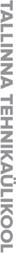{width="0.10694444444444444in" height="1.6868055555555554in"}

**TALLINNA TEHNIKAÜLIKOOL**

INSENERITEADUSKOND

Elektroenergeetika ja mehhatroonika instituut

**Autonoomse laeva situatsiooniteadlikkuse arendamine masinnägemise abil**

**Improving situational awareness of autonomous vessels using computer vision**

BAKALAUREUSETÖÖ

  -----------------------------------------------
  Üliõpilane:      Tanel Treuberg
  ---------------- ------------------------------
  Üliõpilaskood:   193761EAAB

  Juhendaja:       Heigo Mõlder, PhD

  Kaasjuhendaja:   Karl Janson, PhD
  -----------------------------------------------

Tallinn 2023

**AUTORIDEKLARATSIOON**

Olen koostanud lõputöö iseseisvalt.

Lõputöö alusel ei ole varem kutse- või teaduskraadi või inseneridiplomit taotletud. Kõik töö koostamisel kasutatud teiste autorite tööd, olulised seisukohad, kirjandusallikatest ja mujalt pärinevad andmed on viidatud.

"\...\...." \...\...\...\...\...\..... 2023

Autor: Tanel Treuberg

> / allkiri /

Töö vastab bakalaureusetöö/magistritööle esitatud nõuetele

"\...\...." \...\...\...\...\...\..... 2023

Juhendaja: Heigo Mõlder

> / allkiri /

Kaitsmisele lubatud

"\...\...."\...\...\...\...\...\.....2023

Kaitsmiskomisjoni esimees \...\...\...\...\...\...\...\...\...\...\...\...\...\...\...\...\...\...\...\...\...\...\...\...\.....

/ nimi ja allkiri /

+-----------------------------------------------------------------------------------------------------+
|   ------------------------------------------------------------------------------------------------- |
|   **Lihtlitsents lõputöö reprodutseerimiseks ja lõputöö üldsusele kättesaadavaks tegemiseks**[^1]   |
|                                                                                                     |
|   ------------------------------------------------------------------------------------------------- |
|                                                                                                     |
|   -----------------------------------------------------------------------                           |
|                                                                                                     |
|   -----------------------------------------------------------------------                           |
|                                                                                                     |
| > Mina Tanel Treuberg                                                                               |
|                                                                                                     |
| 1.  Annan Tallinna Tehnikaülikoolile tasuta loa (lihtlitsentsi) enda loodud teose                   |
|                                                                                                     |
| > Autonoomse laeva situatsiooniteadlikkuse arendamine masinnägemise abil                            |
| >                                                                                                   |
| > mille juhendaja on Heigo Mõlder                                                                   |
|                                                                                                     |
| 1.  reprodutseerimiseks lõputöö säilitamise ja elektroonse avaldamise eesmärgil, sh Tallinna        |
|     Tehnikaülikooli raamatukogu digikogusse lisamise eesmärgil kuni autoriõiguse kehtivuse tähtaja  |
|     lõppemiseni;                                                                                    |
|                                                                                                     |
| 2.  üldsusele kättesaadavaks tegemiseks Tallinna Tehnikaülikooli veebikeskkonna kaudu, sealhulgas   |
|     Tallinna Tehnikaülikooli raamatukogu digikogu kaudu kuni autoriõiguse kehtivuse tähtaja         |
|     lõppemiseni.                                                                                    |
|                                                                                                     |
| <!-- -->                                                                                            |
|                                                                                                     |
| 2.  Olen teadlik, et käesoleva lihtlitsentsi punktis 1 nimetatud õigused jäävad alles ka autorile.  |
|                                                                                                     |
| 3.  Kinnitan, et lihtlitsentsi andmisega ei rikuta teiste isikute intellektuaalomandi ega           |
|     isikuandmete kaitse seadusest ning muudest õigusaktidest tulenevaid õigusi.                     |
|                                                                                                     |
| 18.05.2023                                                                                          |
+-----------------------------------------------------------------------------------------------------+

# LÕPUTÖÖ LÜHIKOKKUVÕTE

+-------------------------+---------------------------+------------------------------------+
| *Autor:* Tanel Treuberg                             | > *Lõputöö liik:* Bakalaureusetöö  |
+-----------------------------------------------------+------------------------------------+
| *Töö pealkiri*: Autonoomse laeva situatsiooniteadlikkuse arendamine masinnägemise abil   |
+-------------------------+----------------------------------------------------------------+
| *Kuupäev:*18.05.2023    | 58 *lk*                                                        |
+-------------------------+----------------------------------------------------------------+
| *Ülikool:* Tallinna Tehnikaülikool                                                       |
|                                                                                          |
| *Teaduskond:* Inseneriteaduskond                                                         |
+------------------------------------------------------------------------------------------+
| *Instituut:* Elektroenergeetika ja mehhatroonika instituut                               |
+------------------------------------------------------------------------------------------+
| *Töö juhendaja(d):* Heigo Mõlder (PhD), Karl Janson (PhD)                                |
|                                                                                          |
| *Töö konsultant (konsultandid):* Uljana Reinsalu (PhD)                                   |
+------------------------------------------------------------------------------------------+
| *Sisu kirjeldus:*                                                                        |
|                                                                                          |
| Lõputöö eesmärgiks on arendada välja masinnägemise süsteem, mis sobib laeva käigukatsete |
| automatiseeritud läbiviimiseks. See eeldab sobiva riistvara ja masinnägemise mudeli      |
| valikut, masinnägemise süsteemi tarkvara loomist, süsteemi katsetusi ning tulemuste      |
| analüüsi. Analüüsis võrreldakse erinevate mudelite täpsust ja kiirust. Samuti uuritakse  |
| välja, kuidas ning milliste meetoditega on võimalik optimeerida tarkvara nii, et         |
| võimalikult efektiivselt utiliseerida riistvara ning selle tulemusena ka tarkvara tööd   |
| sujuvamaks ning kiiremaks muuta.                                                         |
+------------------------------------------------------------------------------------------+
| *Märksõnad:* Masinnägemine, tehisintellekt, sardsüsteem, manussüsteem, optimeerimine,    |
| konteinerdamine, virtuaalkeskkond, närvivõrk, masinõpe, riistvara kiirendus              |
+------------------------------------------------------------------------------------------+

# ABSTRACT

+------------------------------------+------------------------------------+
| *Author:* Tanel Treuberg           | > *Type of the work:* Bachelor's   |
|                                    | > Thesis                           |
+------------------------------------+------------------------------------+
| *Title*: Improving situational awareness of autonomous vessels using    |
| computer vision                                                         |
+------------------------------------+------------------------------------+
| *Date:* 18.05.2023                 | 58 *pages*                         |
+------------------------------------+------------------------------------+
| *University:* Tallinn University of Technology                          |
|                                                                         |
| *School*: School of Engineering                                         |
+-------------------------------------------------------------------------+
| *Department:* Department of Electrical Power Engineering and            |
| Mechatronics                                                            |
+-------------------------------------------------------------------------+
| *Supervisor(s) of the thesis:* Heigo Mõlder (PhD), Karl Janson (PhD)    |
|                                                                         |
| *Consultant(s):* Uljana Reinsalu (PhD)                                  |
+-------------------------------------------------------------------------+
| *Abstract:*                                                             |
|                                                                         |
| The aim of the thesis is to develop a computer vision system suitable   |
| for automated vessel maneuvering tests. This involves selecting         |
| appropriate hardware and computer vision model, developing software for |
| the computer vision system, conducting system tests, and analysing the  |
| results. The analysis compares the accuracy and speed of different      |
| computer vision models. Additionally, research is conducted to          |
| determine ways to optimize the software in order to efficiently utilize |
| the hardware and thereby make the system run smoother and faster.       |
+-------------------------------------------------------------------------+
| *Keywords:* computer vision, machine vision, embedded system,           |
| optimisation, conteinerisation, virtual environment, neural network,    |
| machine learning, hardware acceleration                                 |
+-------------------------------------------------------------------------+

# LÕPUTÖÖ ÜLESANNE

+--------------------------+-------------------------------------------+
| Lõputöö teema:           | **Autonoomse laeva                        |
|                          | situatsiooniteadlikkuse arendamine        |
|                          | masinnägemise abil**                      |
+--------------------------+-------------------------------------------+
| Lõputöö teema inglise    | **Improving situational awareness of      |
| keeles:                  | autonomous vessels using computer         |
|                          | vision**                                  |
+--------------------------+-------------------------------------------+
| Üliõpilane:              | **Tanel Treuberg, 193761EAAB**            |
+--------------------------+-------------------------------------------+
| Eriala:                  | **Elektroenergeetika ja Mehhatroonika**   |
|                          |                                           |
| Lõputöö liik:            | **bakalaureusetöö**                       |
|                          |                                           |
| Lõputöö juhendaja:       | **Heigo Mõlder, PhD**                     |
|                          |                                           |
| Lõputöö kaasjuhendaja:   | **Karl Janson, PhD**                      |
|                          |                                           |
| (ettevõte, amet ja       | **TTÜ Arvutisüsteemide instituut, Email:  |
| kontakt)                 | karl.janson@taltech.ee**                  |
|                          |                                           |
| Lõputöö ülesande         | 2022/2023 2022/2023 Kevad                 |
| kehtivusaeg:             |                                           |
| (kehtivusaja annab       |                                           |
| juhendaja)               |                                           |
+--------------------------+-------------------------------------------+
| Lõputöö esitamise        | **18.05.23**                              |
| tähtaeg:                 |                                           |
+--------------------------+-------------------------------------------+

\_\_\_\_\_\_\_\_\_\_\_\_\_\_\_\_\_\_\_\_

Üliõpilane (allkiri)

\_\_\_\_\_\_\_\_\_\_\_\_\_\_\_\_\_\_\_\_

Juhendaja (allkiri)

\_\_\_\_\_\_\_\_\_\_\_\_\_\_\_\_\_\_\_\_

Õppekava juht (allkiri

\_\_\_\_\_\_\_\_\_\_\_\_\_\_\_\_\_\_\_\_

Kaasjuhendaja (allkiri)

**1. Teema põhjendus**

TTÜ Elektroenergeetika ja mehhatroonika instituudi, TTÜ Väikelaevaehituse kompetentsikeskuse ja merendusettevõtte Baltic Workboatsi vahelise koostööprojekti raames on eesmärgiks automatiseerida laevade käigukatsed, mida seni on läbi viinud erinevad kaptenid käsijuhtimisega. Seetõttu ei ole katsete tulemused objektiivsed, vaid sõltuvad kapteni laeva käsitsemisest ning andmetes võivad tekkida hälbed, mille põhjal ei saa laeva parameetreid soovitud täpsusega kinnitada. Samuti on käigukatsete läbiviimine väga ajamahukas, sest tihti on vaja teha teatud manöövrit mitu korda, sest mõnel katsel võidakse tüürida liiga suure raadiusega või vale kiirusega, mistõttu tekitab inimlik viga katsete tulemustes ebameeldivaid hälbeid.

Koostööprojekti raames on need käigukatsed plaan teostada arvutiprogrammi abil, mille juures märgib suurt rolli laeva situatsiooniteadlikus. Antud lõputöö raames püütakse arendada laeva situatsiooniteadlikust, luues ümbruskonna tajumiseks masinnägemisel põhineva lahenduse.

**2. Töö eesmärk**

Lõputöö eesmärgiks on arendada välja masinnägemise süsteem, mis sobib laeva käigukatsete automatiseeritud läbiviimiseks. See tähendab sobiva riistvara valikut ja masinnägemise süsteemi tarkvara loomist, selle vahekatsetusi sadamas ja lõpuks ka reaalsel laeval. Samuti välja uurida kuidas on võimalik optimeerida tarkvara nii et võimalikult efektiivselt utiliseerida riistvara ning selle tulemusena ka tarkvara töötlemist sujuvamaks ning kiiremaks muuta.

**3. Lahendamisele kuuluvate küsimuste loetelu:**

- Milline juhtkontroller masinnägemissüsteemi jaoks valida?

- Milline kaamerate süsteem masinnägemise jaoks valida?

- Millist tarkvaralist lahendust probleemi lahenduseks kasutada?

- Kuidas anda masinnägemise süsteemi abil tuvastatud objekti info edasi laeva juhtkontrolleritele?

- Milliseid meetodeid on võimalik tarkvara optimeerimisel rakendada?

- Millist närvivõrku objektide tuvastusel kasutada ning miks?

**4. Lähteandmed**

Lähteinfo koondatakse kokku järgmistest allikatest:

- Uuritakse olemasolevaid lahendusi, mis on maailmas varem tehtud

- Seadmete andmelehed, skeemid

- Projektimeeskonna poolt antav lähteinfo laeva juhtsüsteemi osas

- Erialane kirjandus, veebilehed, teadusartiklid jne.

**5. Uurimismeetodid**

Töö teoreetilises osas lähtutakse allikate (kirjanduse, veebiartiklite, teadusartiklite) analüüsist ning autori erialastest teadmistest ning nende omavahelisest kooskõlast.

Praktilises osas käsitletakse katseid, masinnägemisel kasutavate mudelite võrdlusi ja võimekust, mõõtmiste sooritamisi nende analüüsi (nii graafiliselt kui ka statistiliselt), et saadud tulemused võimaldaksid püstitatud probleemi optimaalseimat lahendamist.

**6. Graafiline osa**

Graafikud, tabelid, joonised on valdavalt töö põhiosas.

**7. Töö struktuur**

(Teoreetilises osas võimalikud väiksemad alateemade muutused)

Lõputöö ülesanne

Sisukord

Eessõna

Mõistete, lühendite, sümbolite loetelu

Sissejuhatus

1.  Probleemi püstitus

2.  Ülevaade seni loodud lahendustest maailmas

3.  Projekti ülevaade

Riistvara valik, võrdlustega

1.  Juhtkontroller

2.  Kaamerad

3.  Juhttorni koostejoonis/üldistatud skeem

4.  Elektriskeem

Masinnägemine ning masinnägemise tarkvara valik, võrdlustega

1.  Masinnägemise tarkvara platvormid, milline, milleks sobilik

2.  Objektide tuvastamine, mis, kuidas ja miks

Masinnägemise ühildamine teiste anduritega täpsema info saamiseks

1.  Radariga

2.  Lidariga

Katsed

1.  Katsed video põhjal simuleeritud keskkonnas masinnägemise testimiseks

2.  Katsed sadamas, juhttorni test

3.  Katsed laeval

4.  Katsete tulemuste analüüs

Järeldused

Kokkuvõtte

Tuleviku arendustööd

1.  Ühildamine AIS marine (Automatic Identification System) süsteemiga

Allikate loetelu

Lisad

**8. Kasutatud kirjanduse allikad**

Allikatena kasutatakse erialast kirjandust, samuti merenduseteemalisi artikleid, Baltic Workboatsi loal ka katsetatavate laevade manööverdamisvõimekuse informatsioon.

- Nvidia Jetson AGX Xavier Developer Kit, <https://developer.nvidia.com/embedded/jetson-agx-xavier-developer-kit>

- Marine Insight, <https://www.marineinsight.com/>

- OpenCV, <https://opencv.org/>

- TensorFlow, <https://www.tensorflow.org/>

- Baltic Workboats, <https://bwb.ee/>

- MindChip, https://mindchip.ee/

**9. Lõputöö konsultandid**

Võimalik konsulteerimine Baltic Workboatsi projekti juhi/tellija/esindajaga, seoses masinnägemise süsteemi installeerimisega prototüüplaevale ning vajalike sisendparameetrite sätestamisega. Samuti ka parameetrite täpsustamisega (pöörderaadius, lubatud kalle, maksimaalne kiirus, kabariidid vöörist ahtrini ja pakpoordist tüüripardani)

**10. Töö etapid ja ajakava**

- Teoreetiline osa (11. märts)

  - Allikate sirvimine/kogumine

  - Peatükkide sisu loomine

- Praktiline osa (2. aprill)

  - Masinnägemise mudel

    - Mudeli valik

    - Implementatsioon

    - Treenimine

  - Katsed

    - Siseruumides

    - Sadamas

    - Laeval

    - Mudeli parameetrite arendamine/täiustamine

- Lõputöö lähteversioon (23. aprill)

  - Teoreetilise osaga

  - Praktilise osaga

  - Esitamine juhendajale (24. aprill)

  - Täpsustuste tegemine, täiendamine (26. aprill)

- Lõputöö valminud (8. mai)

*Kinnise kaitsmise ja/või lõputöö avalikustamise piirangu tingimused formuleeritakse pöördel.*

**SISUKORD**

[EESSÕNA [12](#eessõna)](#eessõna)

[Lühendite ja tähiste loetelu [13](#lühendite-ja-tähiste-loetelu)](#lühendite-ja-tähiste-loetelu)

[SISSEJUHATUS [15](#sissejuhatus)](#sissejuhatus)

[1. KÄIGUKATSED [18](#käigukatsed)](#käigukatsed)

[2. MASINNÄGEMINE [20](#masinnägemine)](#masinnägemine)

[2.1 Masinnägemise tööpõhimõte [21](#masinnägemise-tööpõhimõte)](#masinnägemise-tööpõhimõte)

[2.2 Konvolutsiooniline närvivõrk [22](#konvolutsiooniline-närvivõrk)](#konvolutsiooniline-närvivõrk)

[3. RIISTVARA VALIK [25](#riistvara-valik)](#riistvara-valik)

[3.1 Juhtkontroller ehk pardaarvuti [26](#juhtkontroller-ehk-pardaarvuti)](#juhtkontroller-ehk-pardaarvuti)

[3.2 Tensorituumad ja CUDA [29](#tensorituumad-ja-cuda)](#tensorituumad-ja-cuda)

[3.3 Kaamerad [30](#kaamerad)](#kaamerad)

[3.4 Juhttorn [33](#juhttorn)](#juhttorn)

[4. TARKVARA [35](#tarkvara)](#tarkvara)

[4.1 Masinnägemise närvivõrgu mudel [36](#masinnägemise-närvivõrgu-mudel)](#masinnägemise-närvivõrgu-mudel)

[5. MASINNÄGEMISE RAKENDUS [39](#masinnägemise-rakendus)](#masinnägemise-rakendus)

[5.1 Töökeskkond [39](#töökeskkond)](#töökeskkond)

[5.2 Põhiprogramm [41](#põhiprogramm)](#põhiprogramm)

[5.3 Masinnägemise mudeli ja tarkvara optimeerimine [45](#masinnägemise-mudeli-ja-tarkvara-optimeerimine)](#masinnägemise-mudeli-ja-tarkvara-optimeerimine)

[6. TULEMUSED [47](#tulemused)](#tulemused)

[6.1 Katsete läbiviimine [47](#katsete-läbiviimine)](#katsete-läbiviimine)

[6.2 Tulemuste analüüs [48](#tulemuste-analüüs)](#tulemuste-analüüs)

[KOKKUVÕTE [52](#kokkuvõte)](#kokkuvõte)

[KASUTATUD KIRJANDUSE LOETELU [53](#kasutatud-kirjanduse-loetelu)](#kasutatud-kirjanduse-loetelu)

# EESSÕNA

Käesoleva lõputöö teema kontsept algatati koostöös juhendajatega: Heigo Mõlder ja Karl Janson. Töös kirjeldatud ning selle käigus valminud süsteem on kasutusel TalTechi ja Baltic Workboatsi koostööprojektis „Laevade eelseadistatud autonoomsete avaveekatsete tehnoloogia arendamine".

Soovin tänada juhendajat Heigo Mõlder abi, lõputöö teema ja juhendamise eest, kaasjuhendajat Karl Janson tehnilise lahenduse läbiviimise assisteerimisel ning konsultanti Uljana Reinsalu närvivõrkude teemadel abi eest.

# Lühendite ja tähiste loetelu

AIS automaatne identifitseerimise süsteem (*ingl. k* *Automatic Identification System)*

ARM Arm Holdings'i poolt arendatav vähendatud käsustikuga arvutiarhitektuur (*ingl. k Advanced RISC Machines)*

CNN konvolutsiooniline närvivõrk (*ingl. k* *convolutional neural network)*

COCO Tuntud objektid kontekstis, annoteeritud fotode andmestik (*ingl. k* *Common*

*Objects in Context)*

CPU Arvuti protsessor *(ingl. k* *Central Processing Unit)*

CSI Kaamera jadaühenduse liides (*ingl. k* *Camera Serial Interface)*

CUDA Arvutamise ühtne seadmearhitektuur (*ingl. k* *Compute Unified Device*

*Architecture)*

DL Süvaõpe (*ingl. k* *Deep Learning)*

FPS Kaadrid sekundis (*ingl. k* *Frames Per Second)*

FSD Täielikult autonoomne süsteem Tesla sõidukitele (*ingl. k* *Full Self Driving)*

GB gigabait (*ingl. k* *GigaByte)*

GFLOPs miljardit ujukomarvu operatsiooni sekundis (*ingl. k* *Billions of Floating point*

*Operations per second)*

GPU graafikatöötlusseade, graafikakaart (*ingl. k* *Graphics Processing Unit)*

Gbps gigabitti sekundis (*ingl. k* *Gigabits per second)*

HAVS käsivarre vibratsiooni sündroom (*ingl. k* *Hand Arm Vibration Syndrome)*

HMMA 16 komakohalise ujukomaarv maatriksi korrutamine ja summeerimine (*ingl. k*

*Half precision Matrix Multiply and Accumulate)*

IMMA täisarvulise maatriksi korrutamine ja summeerimine (*ingl. k* *Integer Matrix*

*Multiply and Accumulate)*

L4T Linuxi operatsioonisüsteem Nvidia Tegra manussüsteemidega seadmetele (*ingl.*

*k* *Linux for Tegra)*

MB megabait (*ingl. k* *megabyte)*

NVDEC Nvidia videodekooder (*ingl. k* *Nvidia Video Decoder)*

NVDLA Nvidia süvaõppe kiirendi (*ingl. k* *Nvidia Deep Learning Accelerator)*

ONNX Avatud värvivõrkude vahetamise formaat (*ingl. k* *Open Neural Network*

*Exchange)*

POE toide üle võrgukaabli (*ingl. k* *Power Over Ethernet)*

PVA Programmeeritav Masinnägemise Kiirendi (*ingl. k* *Programmable Vision*

*Accelerator)*

SBC monoplaatarvuti (*ingl. k* *single board computer)*

SoM süsteem moodulil või süsteem kiibistikul (*ingl. k* *System on Module or SOC*

*system on chip)*

TFLOPs triljonit ujukomaarvu operatsiooni sekundis (*ingl. k* *Trillions of Floating point*

*Operations per second)*

TOPs triljonit operatsiooni sekundis (*ingl. k* *Trillions of Operations per second)*

USB universaalne jadasiin (*ingl. k* *Universal Serial Bus)*

YOLO sa vaatad ainult korra, filosoofia, kus närvivõrk töötleb pilti ainult ühe korra

 (*ingl. k* *You Only Look Once)*

eMMC integreeritud multimeediumi kaart (*ingl. k* *embedded MultiMedia Card)*

mAP täpsuste keskväärtuste keskmine (*ingl. k* *mean Average Precision)*

ms millisekund (*ingl. k* *millisecond)*

px piksel (*ingl. k pixel*)

# SISSEJUHATUS

Logistika on inimkonna kui terviku optimaalseks toimimiseks äärmiselt olulisel kohal, hõlmates enda all inimeste ja kaupade transporti ning teenuste osutamist. Seetõttu on väga tähtis, et antud süsteem toimiks praktiliselt veatult ning tõrgeteta, kuid viimased on kahjuks vältimatud, näitena võib välja tuua konteinerlaeva Ever Giveni takerdumisintsidendi Suezi kanalis \[1\]. Üldjuhul on põhjuseks inimfaktor (tähelepanematus, ebaadekvaatne olukorra hindamine) ja/või tehniline rike, mis võib põhjustada tagajärjena õnnetuse.

Laevade ja meremeeste seilamiseks ettevalmistamine on äärmiselt ressursimahukas ning rahaliselt ja ajaliselt kulukas. Avamerel liigeldes on mere käitumine väga ettearvamatu ning uppumisoht on kõrge isegi kõige parema ettevalmistuse juures ning 2019. aastal olid uppumissurmad kolmandal kohal surmade arvult maailmas \[2\] ning merenduses mängivad selles osa ebakompetente ettevalmistus (meremeeste ja laeva puhul), ülerahvastatus pardal, liigne autopiloodi usaldamine ning tähelepanematus või olukordade alahindamine.

Samuti on ka pikk aeg merel vaimselt koormav, sest puudub otsene kontakt lähedastega ning suur osa ajast viibitakse sotsiaalses isolatsioonis, välja arvatud juhtudel kui meeskond koosneb vähemalt kahest liikmest. Lisaks sellele on ka suurem risk haiguste tekkeks nagu: käsivarre vibratsiooni sündroom (HAVS), südameveresoonkonna haigused, kopsupõletik, millest raskematel juhtudel kopsuvähk, üleüldine ülepinge (põhjustatuna lihaspingetest, liigsest emotsionaalsest stressist, üksildustundest, mida üritatakse peletada liigse alkoholi tarbimisega ja/või suitsetamisega, üleväsimusest või/ja vähesest füüsilisest aktiivsusest) ja krooniline depressioon \[3\].

Lahendusi taoliste probleemide vältimiseks on mitmeid, millest hetkel kõige aktuaalsemad ning efektiivseimate tulemustega on autonoomsed juhtimissüsteemid, kasutades radareid ja masinnägemist. Praeguseks on täisautonoomsuse poole püüdlevaid ettevõtteid autonduses mitmeid: Tesla (AutoPilot, FSD) \[4\], Lucid (DreamDrive) \[5\], Waymo \[6\], Nvidia (Nvidia Drive) \[7\] ja Comma ai (odavaim semi-autonoomsust võimaldav süsteem) \[8\].

Merenduses on autonoomsete süsteemide arenduses vähem eelkäijaid: Kongsberg \[9\] ja Rolls Royce \[10\].

Autonoomse süsteemiga laev on palju suurema kasuteguriga kui oleks seda meeskonnaga laev mitmetel põhjustel: laeva mass on väiksem (puudub vajadus ventilatsioonisüsteemi, meeskonna ruumide, kambüüsi, koikude, käimlasüsteemi ja kapteni jaoks), seega meresõiduki tootmiseks vajalik materjali kogus on väiksem, mis omakorda suurendab manööverdusvõimet. Kuna meeskond otseselt ise laeval ei viibi, väheneb ka vajadus maabumiseks (ehk ainult hoolduse/remondi, kauba laadimise või/ja tankimise jaoks) ning laeva opereerimise energiakulu. Samuti saab ka laeva saata liiklema karmimatesse tingimustesse, kujutamata otsest ohtu inimese tervisele (ning parimal juhul säästa aega, võimalusega kasutada otsesemat, kuid ohtlikumat liikumisteed).

Tallinna Tehnikaülikool ja AS Baltic Workboats on koostööpartnerid projektis, mille eesmärk on laevade käigukatsete läbiviimine autonoomselt ehk inimese osaluseta (vt Joonis 1) \[11\]. Samuti on tulevikus ka plaan edasiarendusi teha samas valdkonnas, et rakendada autonoomseid süsteeme ka väljaspool käigukatseid, andes laevadele võimekuse iseseisvalt ülesandeid täita ning merel navigeerida.

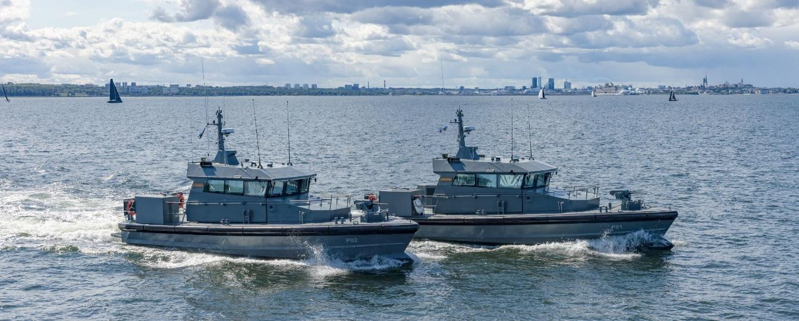{width="6.102777777777778in" height="2.4569444444444444in"}

Joonis 1. Baltic Workboatsi patrullaevad Navy 18 WP \[12\]

Käesoleva bakalaureusetöö eesmärgiks on arendada välja masinnägemise süsteem, mis abistab laeva käigukatsete läbiviimisel. See eeldab sobiliku riistvara, tarkvara ja masinõppe mudeli valimist, seejärel masinnägemise tarkvara loomist ja mudeli optimeerimist.

Püstitatud eesmärgi saavutamiseks otsitakse lahendust järgmistele probleemidele:

- Millist riistvara masinnägemise süsteemi jaoks kasutada?

- Milline masinõppe mudel suudab merel objekte kõige paremini tuvastada?

- Kuidas tuvastada objekte autonoomsel laeval, kasutades masinnägemist?

- Kuidas optimeerida masinõppe mudelit piiratud ressursiga riistvara jaoks?

Lõputöö on üles ehitatud järgnevalt: Käigukatsete peatükis tutvustatakse laevade käigukatsete meetodit ning lahendust nende automatiseerimiseks. Peatükis 1 tuleb juttu masinnägemisest, selle olemusest ja tööpõhimõttest ning masinnägemisel kasutusel olevatest mudelitest selgitatakse spetsiifilisemalt konvolutsioonist närvivõrku. Peatükis 2 räägitakse riistvarast, mida masinnägemise süsteemi loomisel kasutatakse, riistvaraliselt spetsialiseeritud kiirenditest ja antakse süsteemi lihtsustatud ülevaade. Peatükis 3 kajastub ülevaade erinevatest masinnägemise rakenduse loomist võimaldavatest tarkvaradest ja selgitatakse välja millist masinnägemismudelit masinnägemise rakenduses kasutatakse. Peatükis 4 selgitatakse masinnägemise rakenduse olemust ja tööpõhimõtet, samuti kirjeldatakse selle arendusprotsessi ning optimeerimist. Peatükis 5 tehakse katseid masinnägemise mudelitega ja analüüsitakse kui palju mudelite optimeerimine mõjutab rakenduses kaadrite töötluse kiirust. Peatükk 6 võtab kokku töö sisu ning eesmärkide soorituse.

# KÄIGUKATSED

Laeva ehitusel on vaja välja selgitada laeva parameetrid, mis vastaksid eelnevalt sätestatud tingimustele. Samuti märgitakse laeva parameetrid hiljem ka laeva käsiraamatusse. Nende parameetrite välja selgitamiseks on loodud käigukatsed, kus laev läbib määratud teekonna, mille käigus tehakse käsitsi mõõtmised, mida kasutatakse hiljem laeva võimekuse hindamiseks ja tulevaste ehitatavate laevade arendamiseks.

Laevade käigukatsed on vajalikud mõõdistuste täpsuse ja katsete reprodutseerimiseks. Lõputöö kirjutamise hetkel tehakse mõõdistusi küll täpsete seadmetega, kuid laevu juhivad erinevad inimesed ning tulemuste registreerimine käib manuaalselt, mis põhjustab ebatäpsusi ega taga katsete ühtset korratavust.

Käsitsi läbiviidavatel käigukatsetel esinevad mitmed probleemid:

1.  Mõõtetulemuste erinevused, mis sõltuvad laeva operaatori reaktsioonist ning psühholoogilisest seisundist

2.  Kuna laeva juhib käigukatsetel üldjuhul üks isik, siis peab ta mitmete tegevuste jälgimisega paralleelselt tegelema, et andmeid koguda, see omakorda tähendab osalist andmekadu teatud perioodil

3.  Mõõteandmete sisestamine ei ole automaatne, protokolli koostamine on mahukas ning nõuab mitme inimese koostööd

4.  Laeval puudub arusaam teda ümbritsevast keskkonnast (võimekus iseseisvalt situatsioonides toime tulemisega ning õnnetuste vältimisega), seetõttu langeb ka see ülesanne laeva kaptenile, kes võib tähelepanematuse tõttu tekitada kriitilisi olukordi või põhjustada õnnetusi

Seetõttu on mõistlik käigukatseid automatiseerida. Selleks oleks tarvis lisada laevale autonoomsust võimaldavad omadused, mis võimaldavad laeval katseid autonoomselt teha ning katsete käigus ka andmeid ise logida.

Autonoomne süsteem edastab laevale konkreetsed navigeerimiskäsklused ja salvestab andmed määratud perioodi jooksul. Kogutud materjali põhjal selguvad täpsed tulemused. Näiteks lainetes liikuva laeva kiirus on alati muutlik, mistõttu mõõdetud kiirus on otseses seoses registreerimise momendiga. Analüüsides valitud salvestusperioodi andmeid, on võimalik määrata laeva kiiruse karakteristikud katse toimumisel. Eelprogrammeeritud käigukatsed aitavad vältida juhtide erinevusi, näiteks laeva pööramise kiirus ning selleks kulunud aeg sõltub juhi intuitsioonist ja muudest isikuomadustest, mis omakorda takistavad laeva maksimaalse võimekuse objektiivset hindamist \[13\] (vt Joonis 1.1).

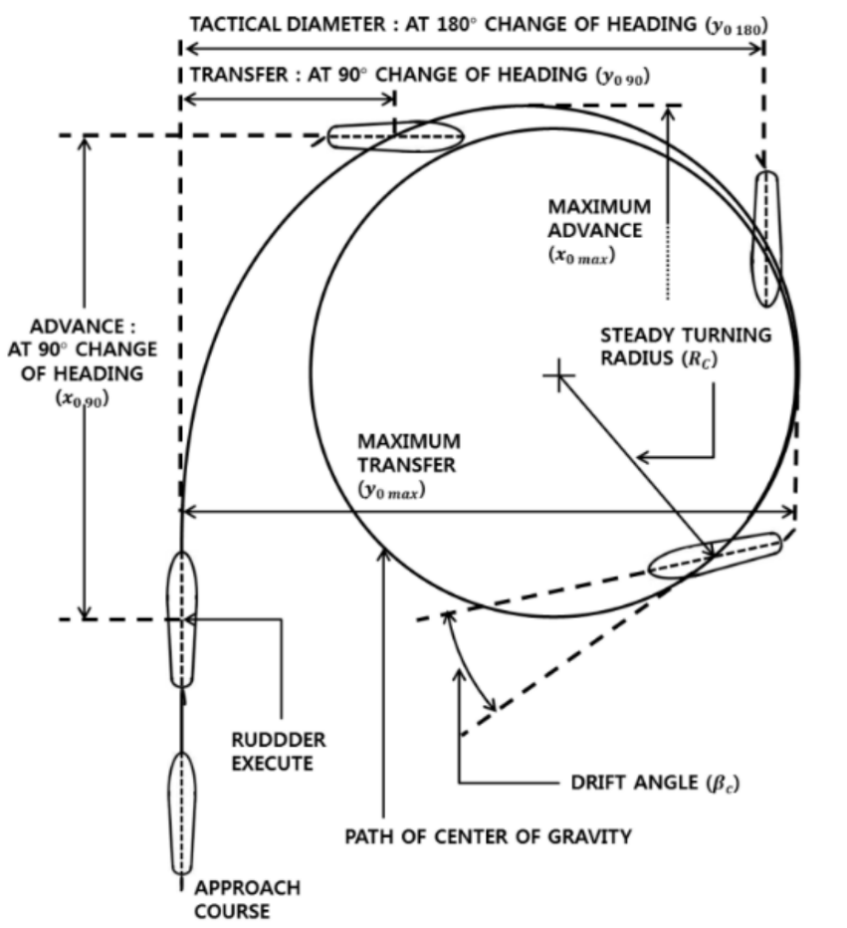{width="4.700169510061242in" height="5.140810367454068in"}

Joonis 1.1. Laeva pöörderaadiuse mõõtmiseks loodud käigukatse \[13\]

Automaatsete käigukatsete jooksul kogutud info annab hea ülevaate laeva projekteerijatele ning inseneridele, mis omakorda on suureks abiks võimekamate laevade projekteerimisel ning olemasolevate veesõidukite arendamisel.

# MASINNÄGEMINE

Masinnägemine on tehisintellekti valdkond, mis tegeleb digitaliseeritud visuaalsest materjalist (fotod, videod) inimesele arusaadava ning vajaliku informatsiooni eraldamisega ning seejärel otsuste tegemisega saadud info põhjal, kasutades arvuteid. Kui tehisintellekt annab arvutitele võime mõelda, siis masinnägemine annab neile võimekuse näha, vaadelda ja mõista ümbritsevat keskkonda.

Masinnägemine toimib sarnaselt inimese nägemisele, kuid inimestel on selles astmes eluaegne edumaa, nad õpivad objekte eristama juba sünnist saati. Inimene on võimeline elu jooksul eristama mitmeid objekte, nende kaugust, nende statsionaarsust või dünaamilisust ning tuvastama vigu piltidel või objektidel.

Masinnägemise puhul "treenitakse" arvuteid, et viia läbi sarnaseid operatsioone, kuid seda palju lühema ajaga, kasutades kaameraid, massiivseid andmehulki ning algoritme inimsilma võrkkesta, optiliste närvide ja aju nägemise interpreteerimise asemel. Antud süsteemil on ka eelisi inimnägemise ees, milleks on spetsialiseerumine. Kui õpetame süsteemile selgeks, milline näeb välja laev ja poi, siis valminud tuvastusmudel on võimeline analüüsima mitmeid sadu objekte ja olukordi sekundis ning vastavalt ka reageerima palju suurema täpsuse-, kindluse- ja kiirusega kui inimene, kes tegeleks sama operatsiooniga.

Masinnägemine on kasutusel mitmetes valdkondades: energiahaldus (tarbimisprognoosid), tootmine (toodete defektide kontroll) ja autotööstus (autonoomsed sõidukid ja juhiabisüsteemid) ning nõudlus masinnägemise spetsialistidele on kasvuteel \[14\].

## Masinnägemise tööpõhimõte

Masinnägemise mudeli treenimiseks ning loomiseks on vaja massiivset andmehulka, mida analüüsitakse mitmeid tuhandeid kordi seni, kuni mudel leiab andmetest seaduspärasusi, mustreid ning objektide puhul iseloomulikke kujundeid, mis lõpuks võimaldavad iseseisvalt uutelt, seni nägemata piltidelt otsitavat objekti tuvastada.

Antud toimingu läbiviimiseks kasutatakse masinõpet, mille üheks osaks on tehisnärvivõrgud ning selle alamosadest täpsemalt süvaõpet ja konvolutsioonilisi närvivõrke.

Masinõppe puhul kasutatakse algoritmilisi mudeleid, mis võimaldavad arvutil aru saada visuaalsete andmete sisust. Piisava hulga andmete edastamisel mudelile suudab arvuti endale andmete põhjal selgeks teha, millega on pildil tegemist ning mis on piltide erinevused. Algoritmid võimaldavad masinal iseseisvalt õppida, mis on oluliselt efektiivsem kui see, et inimene eelprogrammerib arvuti pilte tuvastama.

Konvolutsiooniline tehisnärvivõrk aitab masinnägemise mudelil pildist aru saada, vaadates sisendit mitmete väiksemate, sildistatud aladena. Sildistatud aladel tehakse konvolutsioonilisi operatsioone, mille alusel närvivõrk teeb ennustusi selle kohta, mida ta näeb. Närvivõrk kordab neid operatsioone ning kontrollib ennustuste täpsust iteratiivselt seni, kuni saadud tulemid on vajaliku täpsusega ning tõesed. Pärast taolise operatsiooni edukat kulgemist on mudel võimeline nägema ja tuvastama pilte inimesele arusaadavas formaadis \[14\].

## Konvolutsiooniline närvivõrk

Konvolutsioonilise närvivõrgu (*Convolutional Neural Network, ConvNet, CNN*) puhul on tegemist süvaõppealgoritmiga, mis suudab sisendiks antud pildilt leida sellele iseloomulikud omadused ning neid üksteisest eristada. Võrreldes teiste pildituvastusalgoritmidega, on CNNi jaoks vajalik pildi eeltöötluse maht oluliselt väiksem. Samuti on CNN võimeline iseseisvalt piisava hulga treenimisega piltide omaduste eristamiseks filtreid looma (piltide eripärasid selgeks õppima), erinevalt käsitsi häälestatavatest algoritmidest, mis seda nii täpselt teha ei võimalda. \[15\]

Antud närvivõrku eristavad teistest võrkudest kihid, mis on antud võrgu alustaladeks:

- Konvolutsiooniline kiht (*Convolutional layer*)

- Skaleerimise/ahendamise kiht (*Pooling layer*)

- Täielikult ühendatud kiht (*Fully Connected layer*)

Konvolutsiooniline kiht on CNNi esimene kiht, täielikult ühendatud kiht on viimane, skaleerimine ning täiendavad kihid asetsevad nende vahel. Iga järgneva kihiga suureneb närvivõrgu kompleksus ning täieneb ka süsteemi arusaam sisendiks antud pildist. Ülemised kihid mõistavad lihtsamaid omadusi nagu näiteks värvid ja servad. Sügavamates kihtides tekib süsteemil generaliseeritum arusaam pildil olevatest elementidest või kujutistest ning saadud info põhjal, eeldusel, et seda on piisavalt, teeb süsteem otsuse, millega on fotol tegemist.

**Konvolutsiooniline** kiht (*convolutional layer*) on CNNi olulisim osa närvivõrgus, milles toimub kõige suurem hulk arvutusi. Antud kiht vajab sisendinfot, filtrit ja tunnusjoonte kaarti (*feature map*). Eeldame et sisendina on tegemist värvilise pildiga, mis on kolme dimensioonilise maatriksi kujul (roheline, punane, sinine -- kolm kanalit, kõrgus, laius, sügavus -- kolm dimensiooni). Sellega on sisendandmed määratud. Samuti on meil tarvis ka tunnusjoonte tuvastusfunktsiooni ehk kernelit ehk **filtrit**, mis liigub astmeliselt üle andmete ning kontrollib kas teatud omadus eksisteerib pildil ning sooritab ka sellekohased arvutused. Eelnevalt kirjeldatud operatsioon on konvolutsioon.

**Filtri** puhul on tegemist kahedimensioonilise, konstantsete kaaludega täidetud maatriksiga, mis esindab pildi osa. Filtreid on erinevates suurustes, kuid traditsiooniliselt on nad kolm korda kolm maatriksina. Pildi osale rakendatakse filter, mille tulemuseks on pildi ala maatriksi ning filtri maatriksi skalaarkorrutis, mis antakse edasi väljundmaatriksi. Seejärel nihkub filtri maatriks ette määratud pikslite arvu võrra edasi, kuni terve pildiga on antud operatsioon tehtud ning mille tulemusena on saadud konvolutsiooniliste tunnuste kaart (vt Joonis 2.2.1).

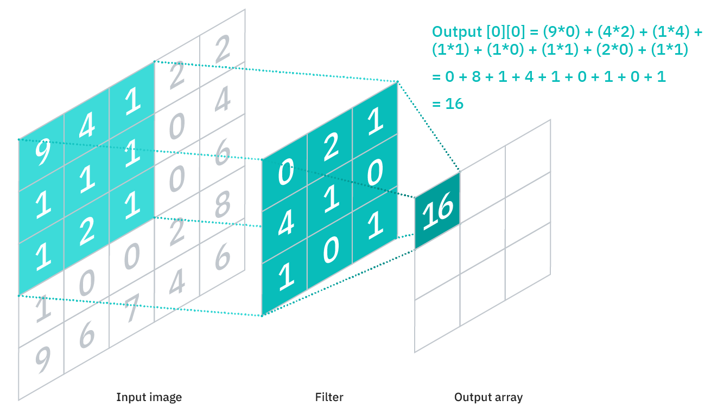{width="6.101744313210848in" height="3.5555555555555554in"}

Joonis 2.2.1. Maatrikskujul pildil (vasakul) tehakse operatsioon filtriga (keskel), mis annab tulemuseks skalaarkorrutise tunnuste kaardina (paremal)

Joonist vaadeldes näeme, et väljundmaatriksis vastab üks argument mitmele sisendpikslile ehk antud operatsiooni puhul konvolutsiooniline kiht ja ka järgnevalt arutatav skaleerimise kiht kuuluvad osaliselt ühendatud närvivõrgu kihtide hulka. Pärast iga konvolutsioonilist operatsiooni toimub tunnuste kaardi protsesseerimine ReLU \[16\] aktiveerimise funktsiooni kihis ning seejärel saadetakse saadud väljundid **skaleerimise** kihti.

**Skaleerimise** kiht (*pooling layer*) tegeleb sisendi alla skaleerimisega vähendades seetõttu ka sisendparameetrite arvu, suurendades närvivõrgu efektiivsust ning vähendades võrgu ületreenimise riski. Sarnaselt konvolutsioonilise kihi operatsioonidele, toimub ka siin töötlus kogu pildi peal, ainukese erinevusena konvolutsioonist, puuduvad selle kihi filtril kaalud. Antud kihis on võimalik teha maksimaalset skaleerimist (*max pooling*) ja keskmistatud skaleerimist (*average pooling*). Esimesel puhul toimub filtri liikumisel üle pildi maksimaalse väärtusega piksli valik, mis saadetakse väljundmaatriksisse, teisel puhul arvutatakse filtri liikumisel üle pildi pikslite keskmine väärtus, mis väljundmaatriksisse edastatakse. Maksimaalset skaleerimist kasutatakse rohkem kui keskmistatud skaleerimist.

**Täielikult ühendatud** kiht (*fully connected layer*) tegeleb eelmistest kihtidest kogutud ja filtreeritud info klassifitseerimisega. Antud kiht kasutab softmax \[17\] aktiveerimisfunktsiooni sisendite korrektseks klassifitseerimiseks, väljastades igale klassile tõenäosuse hinnangu, kus kõikide klasside hinnangute summa on üks (vt Joonis 2.2.2). \[18\]

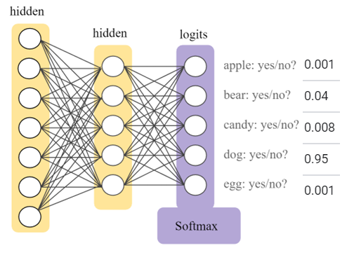{width="5.250732720909887in" height="3.8963768591426073in"}

Joonis 2.2.2. SoftMaxi funktsiooniga rakendatud väljundite kiht närvivõrgus (lilla) ja tõenäosused iga klassi kohta (paremal) \[17\]

# RIISTVARA VALIK

Riistvara valikul lähtuti etteantud nõuetest, et loodav juhttorni prototüüp toimiks võimalikult veatult ning töökindlalt. Samuti arvestati ka sellega, et juhttorn oleks võimalikult lihtsasti ümber seadistatav erinevatele laevatüüpidele kasutamiseks. Esitatud nõuded süsteemile olid järgnevad:

- Sisendiks kolm kaamerat, resolutsiooniga vähemalt 1000x1000 pikslit

- Laevade tuvastuskiirus vähemalt 15 kaadrit sekundis

Tulevikus plaanitakse taolist süsteemi rakendada erinevatel laevatüüpidel, mistõttu on komponendid valitud laialdaselt kasutatavate ning hõlpsasti saadaolevate seadmete hulgast.

## Juhtkontroller ehk pardaarvuti

Juhtkontroller on seade, mis tegeleb selle külge ühendatud kaameratelt saadud informatsiooni töötlemisega ning tulemuste edastamisega autopiloodile. Pardaarvuti asetseb laeva juhttornis, ümbritsetuna kolmest kaamerast. Kaameratelt saadava info peal (antud kontekstis reaalajas video) rakendatakse analüütilisi algoritme, mille väljundina saadakse info (tuvastatud objektid ning nende suhteline asukoht kaadris), mis edastatakse autopiloodile, andes lisainfot ümbritseva keskkonna kohta, mille põhjal viimane teeb otsuse, kuidas laevaga käituda.

Antud ülesande lahendamiseks on saadaval mitmeid monoplaatarvuteid (*Single-Board Computer*, (SBC) \[19\], *System on Module* (SoM)), populaarseimatena Nvidia Jetson seeria \[20\], mis on tehisintellekti ning masinnägemise ja masinõppe rakendusteks spetsialiseeritud ja Raspberry Pi \[21\]. Antud ülesande lahendamisel välistame Raspberry Pi valikutest kuna juhttorni süsteem hõlmab 4 kaameraga paralleelselt töötamist, (Raspberry Pi'l ainult 1 kaamerasisend). See vajab rohket arvutusvõimsust, kuid antud seadmel pole selle kohast võimekust, ega vajalikku riistvara (seadme protsessoris on küll integreeritud graafikakaart, kuid antud ülesande lahendamiseks jääb see liiga nõrgaks). Seetõttu paralleelsete toimingute jaoks on eelkõige kasulik eraldiseisev graafikakaart (*Graphics Processing Unit* (GPU) \[22\]) koos spetsialiseeritud graafikatuumadega (*CUDA Cores* \[23\]), mis on Nvidia Jetson arvutite eeliseks.

Jetsonite seeriasse kuuluvad 4 seadet: Nano, TX2, Xavier NX ning AGX Xavier, mille hulgast viimane kõige võimekam (vt Tabel 3.1.1). Nano on kõige algelisem versioon, millega saab lihtsaimaid masinnägemise rakendusi valmistada, TX2 on sellest mõnevõrra võimekam protsessori ning graafikakaardi arvutusvõimsuse kohalt ning Xavier NX ning AGX Xavier on mõeldud tööstuslikkele kasutusaladele ning nende eelisteks on kuue- ja kaheksatuumalised protsessorid ning Volta arhitektuuriga graafikakaardid, mis sisaldavad ka endas maatriksoperatsioonide kiirendeid (*Tensor Cores*) \[24\], (vt Joonis 3.1.1).

Tabel 3.1.1. Jetson seeria arvutite parameetrid \[24\]

+----------------+----------------+------------------+------------------+
| **Parameters** | **Jetson       | **Jetson TX2     | **Jetson Xavier  |
|                | Nano**         | Series (NX,      | Series (NX,      |
|                |                | TX2i)**          | AGX)**           |
+----------------+----------------+------------------+------------------+
| AI Performance | 472 GFLOPs     | 1.33 TFLOPs      | 21/30 TOPs       |
+----------------+----------------+------------------+------------------+
| GPU            | 128-core       | 256-core NVIDIA  | 384/512-core     |
|                | NVIDIA         | Pascal™          | NVIDIA Volta™    |
|                | Maxwell™       |                  | with 48/64       |
|                |                |                  | Tensor Cores     |
+----------------+----------------+------------------+------------------+
| CPU            | Quad-Core Arm  | Dual-Core NVIDIA | 6/8-core NVIDIA  |
|                | Cortex-A57     | Denver and       | Carmel Arm       |
|                |                | Quad-Core Arm    |                  |
|                |                | Cortex-A57       |                  |
+----------------+----------------+------------------+------------------+
| DL Accelerator | ---            | ---              | 2x NVDLA v1      |
+----------------+----------------+------------------+------------------+
| Vision         | ---            | ---              | 2x PVA v1        |
| Accelerator    |                |                  |                  |
+----------------+----------------+------------------+------------------+
| Memory         | 4 GB           | 4/8 GB           | 8/16/32/64 GB    |
|                |                |                  |                  |
|                | 64-bit LPDDR4  | 128-bit LPDDR4   | 128-bit LPDDR4x  |
+----------------+----------------+------------------+------------------+
| Storage        | 16 GB          | 16/32 GB         | 16/35/64 GB      |
+----------------+----------------+------------------+------------------+
| CSI Camera     | Up to 4        | Up to 5/6        | Up to 6 cameras  |
|                | cameras        | cameras\         |                  |
|                |                | (up to 30 Gbps)  | (up to 62 Gbps)  |
|                | (up to 18      |                  |                  |
|                | Gbps)          |                  |                  |
+----------------+----------------+------------------+------------------+

Eeldusel et vaja on analüüsida kolmest kaamerast tulevat infot paralleelselt ning täpselt, oleks kõige mõistlikum kasutada Xavier seeria süsteemi. Seda just seetõttu, et võrreldes teiste seeriatega on Xavier seeria arvutite jõudlus tagatud suurema hulga graafikakaardi tuumadega, uuema arhitektuuriga (Volta \[25\]), mis sisaldab endas maatrikskiirendeid (*Tensor Cores*, mida vajavad närvivõrgud maatriksarvutustes) ning süvaõppe kiirendeid (*Deep Learning Accelerator*), mis võimaldavad mitme kaamera sisendiga tõhusamalt operatsioone teha.

Antud seerias on valikus nii NX kui ka AGX Jetsonid, mille hulgast on valitud parimad kandidaadid (vt Tabel 3.1.2). Nende hulgast sobilikuim on Jetson AGX Xavier, sest antud seade peab olema võimeline jooksutama mahukat närvivõrku ning tegelema mitme operatsiooniga korraga (kaameratelt info lugemine, info töötlemine närvivõrgus, töödeldud info kujutamine väljundvideol), mis nõuab suurt hulka arvutuslikku ressurssi.

Tabel 3.1.2. Jetson AGX Xavieri ja Xavier NXi parameetrid \[24\]

  -------------------- ---------------------------------- -------------------------------------------------
  **Parameters**       **Jetson AGX Xavier**              **Jetson Xavier NX 16GB**

  AI Performance       32 TOPs                            21 TOPs

  GPU                  512-core NVIDIA Volta™ GPU with\   384-core NVIDIA Volta™ GPU with 48 Tensor Cores
                       64 Tensor Cores                    

  CPU                  8-core NVIDIA Carmel Arm®v8.2\     6-core NVIDIA Carmel Arm®v8.2 64-bit CPU\
                       64-bit CPU\                        6MB L2 + 4MB L3
                       8MB L2 + 4MB L3                    

  DL Accelerator       2x NVDLA v1                        2x NVDLA v1

  Vision Accelerator   2x PVA v1                          2x PVA v1

  Memory               32 GB 256-bit LPDDR4x\             16 GB 128-bit LPDDR4x\
                       136,5 GB/s                         59,7 GB/s

  Storage              32 GB eMMC 5.1                     16 GB eMMC 5.1

  CSI Camera           Up to 6 cameras (up to 62 Gbps)    Up to 6 cameras (up to 30 Gbps)
  -------------------- ---------------------------------- -------------------------------------------------

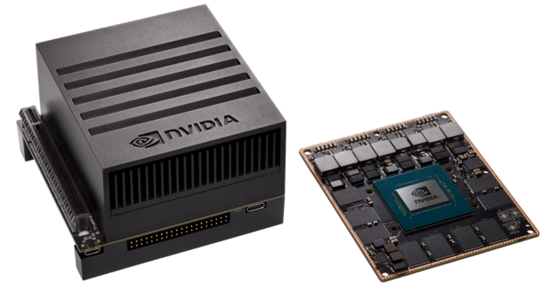{width="4.097634514435695in" height="2.084724409448819in"}

Joonis 3.1.1. Valitud arvuti: Jetson AGX Xavier (paremal ilma jahutusplokita) \[26\]

## Tensorituumad ja CUDA

Tensorituumade (*Tensor Core'ide*) puhul on tegemist programmeeritavate maatrikstehete kiirenditega, mis viivad läbi operatsioone CUDA \[23\] tuumadega paralleelselt. Antud tuumad rakendavad uuemat sorti ujukomaarvudega ja täisarvudega teostatavad tehted HMMA (*Half-Precision Matrix Multiply and Accumulate*) ja IMMA (*Integer Matrix Multiply and Accumulate*), mille mõjul lineaarsed tehted, signaalitöötlus ning süvaõppeinterferents kiirenevad \[27\] (vt Joonis 3.2.1).

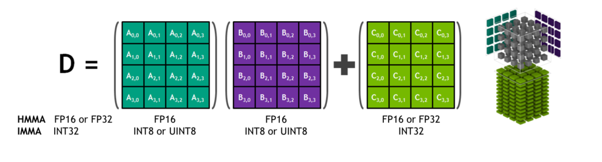{width="6.102777777777778in" height="1.645138888888889in"}

Joonis 3.2.1. Tensor Core, kolmedimensiooniliste 4x4x4 maatriksite korrutamine ning summeerimine \[27\]

CUDA puhul on tegemist paralleelarvutuseks mõeldud platvormi ning programmeerimise mudeliga, mis suurendab tehtavate arvutuste hulka mitmekordselt, kasutades selleks protsessori asemel graafikakaarti \[23\].

CUDA eesmärgiks on kiirendada paralleelarvutusi ning CUDA tuum on analoogne protsessori tuumaga. Ainukeseks erinevuseks on nende ehitus, protsessori tuum on võimeline lahendama kompleksseid arvutusi jadamisi, CUDA tuum lihtsamaid arvutusi graafikakaardis. Eeliseks graafikakaardil protsessori ees on see, et CUDA tuumasid on ühele kiibile paigutatud tuhandeid, mis võimaldab komplekssed arvutused jagada mitmete tuumade vahel ära ning seetõttu ka sooritada arvutused kiiremini, kui protsessor väiksema arvu võimekamate tuumadega. Antud tehnoloogia on integreeritud ning laialdaselt kasutusel masinõppe vallas Nvidia poolt.

## Kaamerad

Kaamerate puhul tuleb arvestada mitmete parameetritega, et tagada süsteemi nõuetekohasus ning edukas toimimine. Kuna antud ülesandes asetseb masinnägemissüsteem juhttornis, mis kinnitub laeva mastile, tuleb kindlasti arvestada sellega et kaamerad või seade kuhu nad asetatakse, peavad võimelised töötama laialdastes temperatuurivahemikes ning muutlikes ilmastikuoludes. Samuti tuleks kaamera tarkvara puhul eelistada üldjuhul värskeimat ja selgelt dokumenteeritud materjali ning arvestada selle ühilduvust juhtarvutiga. See tagab parema kaamera konfigureerimise ning võimaldab ka seeläbi rakendatavat masinnägemistarkvara hõlpsamini hallata.

Kaamerate valikul arvestati järgnevate parameetritega:

- **Resolutsioon** (pikslites, px) -- otseselt seotud objektide tuvastustäpsusega ning tuvastuskiirusega. Mida väiksema resolutsiooniga sisend antakse tuvastusalgoritmile, seda ebatäpsem/ebakindlam on närvivõrgu ennustustulemus. Sel juhul on tuvastusprotsessi kiirus suurem, kuna algoritm tegeleb väiksema andmehulgaga, millega arvutusprotsesse on vähe, mis lõpptulemusena parandab interferentsi kiirust.

> Suurema resolutsiooni korral paraneb seega tuvastustäpsus kuid väheneb interferentsi kiirus, sest sisendandmete hulk suureneb. Suure resolutsiooniga fotol on rohkem informatsiooni, mis omakorda võimaldab närvivõrgul kindlamaid ennustusi anda.

- **Kaadrisagedus** (*Frames per second* -- kaadrit sekundis, FPS) -- parameeter, mis kirjeldab kaamera informatsioonivoo edastuskiirust ehk suhet edastatava kaadrihulga ning aja vahel. Suur kaadrisagedus tagab visuaalselt sujuvama andmevoo kuvamise ning lihtsama jälgitavuse, samuti on ka andmekadu väiksem. Väikese kaadrisageduse korral oleks objekti jälgimine ning teekonna ennustamine oluliselt raskem, sest visuaalselt on objekti liikumine katkendlik ning seetõttu ka närvivõrgu ennustuste täpsus halvatud.

- **Värvussensor** (mono-, polükromaatiline sensor) -- ehk ühevärviline või mitmevärviline sensor. Ühevärviline sensor on sobilik keskkondadesse, kus objekti ning keskkonna vaheline värvikontrast on suur, tagades efektiivse objektituvastuse. Kuna tegemist on monokromaatilise pildiga, siis iga piksli kohta esitatakse üks väärtus, mis jääb kindlasse vahemikku (üldjuhul 0...255 või 0.0...1.0)

> Polükromaatiline sensor sobib seevastu keskkonda, kus kontrast tausta ja objekti vahel ei ole kuigi suur või objekti tuvastamine nõuab rohkem informatsiooni. Sellisel moel pildi edastamisel esitatakse kolm väärtust maatriksina, RGB (vastavalt Red -- punane, Green -- roheline, Blue - sinine) värvustena vahemikes (0...255 või 0.0...1.0, näiteks \[255, 0, 255\]). Taoline edastusviis on andmete hulgalt kolm korda mahukam kui monokromaatilise pildi edastamisel, kuna iga piksli kohta esitatakse kolm väärtust.

Seadmed, mis eelmainitud parameetrile vastaksid on järgnevad (vt Tabel 3.3.1):

Tabel 3.3.1. Parameetritele sobilikud kaamerad

+----------------+----------------------+-----------------+----------+----------+------------+
| **Kaamera      | **Resolutsioon(px)** | **Kaadrisagedus | **Töötemperatuur    | **Liides** |
| nimi**         |                      | (FPS)**         | (°C)**              |            |
+----------------+----------------------+-----------------+----------+----------+------------+
| SurveilsQUAD - | 1920x1080            | 120             | -30      | 85       | CSI        |
| Sony IMX290    |                      |                 |          |          |            |
| System \[28\]  |                      |                 |          |          |            |
+----------------+----------------------+-----------------+----------+----------+------------+
| OpenCV AI Kit: | 1280x800 (stereo)    | 120 (stereo)    | N/A      | N/A      | USB-C/PoE  |
| OAK---D \[29\] | 4056x3040 (keskmine) |                 |          |          |            |
|                |                      | 60 (keskmine)   |          |          |            |
+----------------+----------------------+-----------------+----------+----------+------------+
| OpenCV AI Kit: | 4056x3040            | 60              | N/A      | N/A      | USB-C/PoE  |
| OAK---1-PoE    |                      |                 |          |          |            |
| \[30\]         |                      |                 |          |          |            |
+----------------+----------------------+-----------------+----------+----------+------------+
| Atlas IP67 7.1 | 3208x2200            | 74              | -20      | 55       | PoE        |
| MP Model       |                      |                 |          |          |            |
| \[31\]         |                      |                 |          |          |            |
+----------------+----------------------+-----------------+----------+----------+------------+
| Atlas IP67 2.8 | 1936x1464            | 173             | -20      | 55       | PoE        |
| MP Model       |                      |                 |          |          |            |
| \[32\]         |                      |                 |          |          |            |
+----------------+----------------------+-----------------+----------+----------+------------+
| Arducam 12MP   | 4056x3040            | 60              | N/A      | N/A      | USB-C      |
| IMX477 \[33\]  |                      |                 |          |          |            |
+----------------+----------------------+-----------------+----------+----------+------------+
| Arducam        | 2592×1944            | 30              | N/A      | N/A      | CSI ja     |
| Fisheye Camera |                      |                 |          |          | Ethernet   |
| \[34\]         |                      |                 |          |          |            |
+----------------+----------------------+-----------------+----------+----------+------------+

\*N/A -- andmed puuduvad

Töö kirjutamise hetkel kasutati algselt SurveilsQUAD kaameraid, kuna need olid antud arvutisüsteemi jaoks eelnevalt ette valmistatud ning projektis olevate osapoolte poolt olid ka Xavierile vastavad tarkvaralised muudatused tehtud arvutisüsteemide instituudis. Lõputöö kirjutamise käigus valmiv projekt oli arendusfaasis, mistõttu oli ka eelarve piiratud ning piirduti esialgu kaameratega, millel oli katsetuste jaoks põhivõimekus olemas. Juhttorni disaini käigus selgus, et valitud kaamerate paigutus oli lühikeste kaablite tõttu piiratud ning tootja ei tarninud seadmetele pikemaid kaableid.

Seetõttu sai valitud Arducam Mini kaamera (vt Joonis 3.3.1), mis ühendati raspberry pi külge ning omakorda etherneti kaabliga Ethernet switchi ning sealt lõpuks Jetson Xavieri külge. Sellega lahendus ka kaablite pikkuse probleem ning samuti oli võimalik ka Xavierile installeerida värskeim tarkvara, mida eelmiste kaamerate vananenud draiverid ei toetanud.

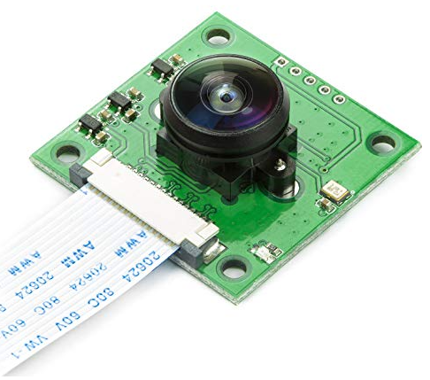{width="2.7510411198600173in" height="2.4283891076115487in"}

Joonis 3.3.1. Arducam Fisheye kaameraga moodul \[34\]

## Juhttorn

Juhttorn asetseb laeva vööris (vt Joonis 3.4.2) ning selle ülesanne on laeva juhtimine üle võtta laeva kapteni käsul ning tegeleda sellega autonoomselt võimalikult vähese kapteni sekkumisega. Selleks on tornil olemas aju Jetson AGXi kujul, mis tegeleb kõikidest anduritest ning kaameratest saadava info kogumise, töötlemise ning seejärel juhtimisotsuse edasi saatmisega autopiloodile, mis omakorda saadab signaalid laeva mootoritele ja tüürile. Jetson saab infot oma ümbritseva keskkonna kohta kaameratest, X-band radarist, AISist ning ilmajaamast tuuleanduri kujul. Andmevahetus juhttorni süsteemis toimub läbi etherneti jaoturi ning 4G ruuteri mis võimaldab saata ning vastu võtta andmeid kasutajalt. Samuti on võimalik arendajatel teha tarkvara uuendusi laeva süsteemidele. AIS (Automaatne Identifitseerimise Süsteem) aitab määrata laeva asukoha teiste meresõidukite suhtes, kasutades satelliite, radar tuvastab punktipilvedega lähedasemaid objekte ning kaamerad ja nendel jooksev masinnägemine tuvastab objektide hulgast laevu ja teisi meresõidukeid. AIS, radar ning kaamerad masinnägemisega täiendavad üksteist, aidates laeval enda ümbruskonda tuvastada ning selles orienteeruda. Süsteemi toidab alalisvooluallikas (vt Joonis 3.4.1). 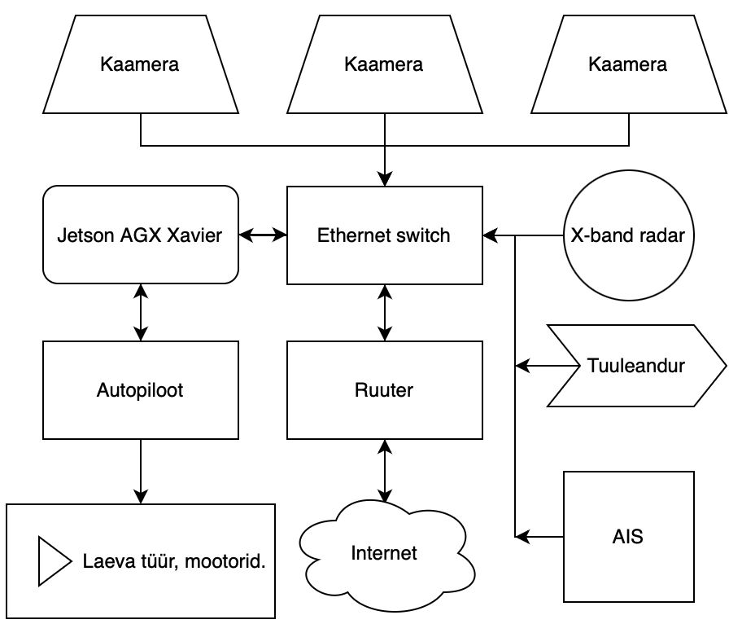{width="6.102083333333334in" height="5.125in"}Joonis 3.4.1. Juhttorni lihtsustatud toimimisskeem

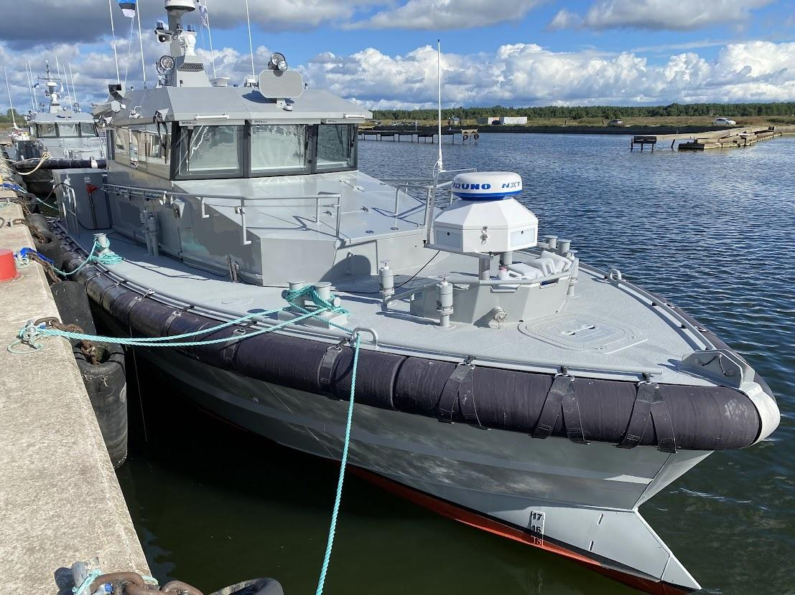{width="6.101744313210848in" height="4.569444444444445in"}

Joonis 3.4.2. Juhttorni asetus patrulllaeval \[35\]

# TARKVARA

Masinnägemise süsteemide loomiseks on olemas erinevaid tarkvaralisi lahendusi. Antud töö tarkvara hõlmab endas mitmeid üksteisest sõltuvaid osi: pilditöötlus ja edastamine, andmetöötlus ja närvivõrgud.

**Pilditöötluseks** on saadaval mitmeid mooduleid (OpenCV \[36\], Scikit-Image \[37\], SciPy \[38\], Pillow \[39\]), mille hulgast masinõppe jaoks spetsiifiliselt on loodud OpenCV ja Scikit-Image. Antud ülesande lahendamisel rakendati OpenCV moodulit Scikit-Image asemel, kuna esimesel on ka olemas videote lugemise tugi Gstreameri \[40\] näol, mis võimaldab kasutada Jetson arvutisse integreeritud Nvidia video dekoodrit \[41\]. See säästab protsessorit pildivoo lugemisel ning teeb seda ka oluliselt efektiivsemalt, jättes pilditöötluse ning masinnägemise mudeli töö jaoks arvuti protsessorile rohkem võimekust alles.

**Andmetöötluse** jaoks on laialdasel kasutusel Pandas \[42\] moodul, mis võimaldab lihtsate ning intuitiivsete käskudega andmeid analüüsida ning nendega manipuleerida. Antud moodul teeb toiminguid protsessori peal ning ekstreemsemate andmemahtude puhul võib andmete töötlemine ajamahukaks minna. Lisaks Pandasele on loodud mitmeid alternatiivseid mooduleid, mis on sarnaselt või minimaalse vahega paremini optimeeritud, kuid nendest kõige sarnasema tööpõhimõtte ja kirjakeelega on cuDF \[44\]. CuDF on olemuselt kõige sarnasem Pandasega, kuid kasutab protsessori asemel graafikakaarti andmete töötluseks, mis just suurte andmemahtude talitlemisel annab ajaliselt suure eelise Pandase ees, kuna andmete töötlus toimub palju suurema paralleelsusega, kui protsessorit kasutades. Antud töö kirjutamise hetkel on kasutuses Pandase moodul, kuna töö autoril on selle mooduliga laialdasem töötamise kogemus ning. Hiljem on plaan minna üle cuDFiga arendamisele tarkvara optimeerimise eesmärkidel.

**Närvivõrkude** loomiseks on olemas mitmeid platvorme ning raamistikke: TensorFlow \[45\], Keras \[46\], PyTorch \[47\], Scikit-Learn \[48\], mille hulgast populaarseimad ning laialdasemas kasutuses on TensorFlow ja PyTorch. Antud töös kasutati PyTorchi, kuna võrreldes TensorFlowiga on PyTorchi süntaks rohkem püütonlik, mistõttu on ka seda Pythoni objektidega lihtsam ühildada ning veateadete puhul kergem aru saada kus viga tekkis. Samuti on töö autoril eelnev kogemus PyTorchiga arendamisel.

## Masinnägemise närvivõrgu mudel

Objektide tuvastamiseks on saadaval mitmeid mudeleid, mis erinevad üksteisest täpsuse, sisendresolutsiooni, suuruse ja kiiruse poolest. Mudeli valimisel tuleb arvestada süsteemi jõudlusega, võimekamad süsteemid nagu näiteks serverid, suudavad jooksutada massiivseid ning täpseid mudeleid paralleelselt ja minimaalse mõjuga sisendite töötlemise kiirusele. Väiksemad süsteemid nagu sülearvutid ning manussüsteemid seevastu oleksid sobivamad väiksemate ning suurema kiirusega mudelite jooksutamiseks.

Tabel 4.1.1. Populaarseimate mudelite parameetrite ülevaade

  ------------------------- ----------------------------- ---------------------- ------------------------
  **Mudel**                 **Maksimaalne sisend (px)**   **Kiirus (ms)**        **Täpsus (mAP)**

  FasterRCNN \[49\]         1000x600                      198                    73,2 (PASCAL VOC 2007)

  YOLOv5 \[50\]             1280x1280                     26,2 (V100 GPU)        72,7 (MSCOCO)

  MobileNet SSD V2 \[51\]   320x320                       200 (Google Pixel 1)   22,2 (MSCOCO)

  EfficientDet \[52\]       1536x1536                     153 (V100 GPU)         55,1 (MSCOCO)
  ------------------------- ----------------------------- ---------------------- ------------------------

Antud süsteemi jaoks tuli mudeli valimisel arvestada parima mudeli täpsuse ja kiiruse suhtega. Samuti pidi valitav mudel olema ka võimeline mitmelt videosisendilt korraga infot töötlema (vt Tabel 4.1.1).

Antud ülesande lahendamiseks osutus valituks Yolov5 arhitektuuriga närvivõrk, mis on Ultralytics'i \[53\] poolt loodud edasiarendusena Yolov4st \[54\] ning on kiirem ja täpsem kui selle eelkäijad. Samuti on tegemist ka kompaktse mudeliga, mis on hõlpsasti sardsüsteemidel jooksutatav. Mudel toimib ühekordsel kaadri töötlemise filosoofial (*You Only Look Once*) ehk pilt läbib võrku ainult ühe korra (erinevalt teistest mudelitest), mille käigus toimub objektituvastus ja klassifikatsioon korraga, mistõttu on ka mudeli tuvastuste operatsiooni kiirus suurem (vt Joonis 4.1.1).

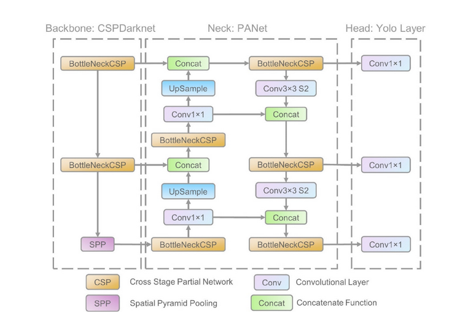{width="6.101744313210848in" height="4.125in"}

Joonis 4.1.1. Yolov5 mudelite arhitektuur \[55\]

Mudel koosneb kolmest osast: Selgroog, kael ja pea.

- **Selgroog** (*backbone*) ehk baas millele mudel ehitatakse, antud juhul on selleks valitud CSPNet (*Cross-Stage Partial Network*). Tegemist on närvivõrgu mudeli tüübiga, mis on jaotatud mitmeks osaks (*Cross-Stage*), milles iga kiht tegeleb ette antud pildilt informatsiooni eraldamisega nagu äärised ja kujundid, mis on iseloomulikud antud objektile pildil. Osa informatsioonist mida eelnevates kihtides omastatakse, antakse edasi järgmistele kihtidele töötlemiseks (*Partial*), mis võimaldab võrgul järgemööda paremini ning täpsemini aru saada mida pildil kujutatakse kasutades eelmistelt kihtidelt saadud töödeldud infot. Backbone koosneb peamiselt konvolutsioonilistest kihtidest ja allaskaleerimise kihist, mille väljund läheb edasi mudeli kaela. Taolise arhitektuuriga mudel aitab vähendada vajalike arvutuslike protsesside hulka.

- **Kael** (*neck*) närvivõrgus tegeleb selgroost saadud informatsiooni kokkupaneku ja organiseerimisega tunnusjoonte maatriksisse (*feature map*), kasutades filtreid. Antud mudel rakendab ruumilist tähelepanu koondamise meetodit, mis aitab närvivõrgul keskenduda olulistele osadele pildil ja ruumilist püramiid-skaleerimise kihti (*Spatial Pyramid Pooling*), mis võimaldab objekte tuvastada erinevatel resolutsioonidel.

- **Pea** (*head*) tegeleb tuvastuste tõenäosuste ning koordinaatide loomisega kaadrilt leitud objektidele. Antud mudelis kasutatakse ka ankurdamiskaste (*anchor boxes*), mis on eelnevalt seadistatud kuvasuhetega, mis aitavad erinevate suurustega ning kujudega objekte tuvastada. Mudeli pea sisaldab endas hulka konvolutsioonilisi kihte, mis tegelevad tuvastuste koordinaatide ja tõenäosuste ennustamisega iga objekti kohta \[55\]

# MASINNÄGEMISE RAKENDUS

Antud töö eesmärgiks oli luua masinnägemise rakendus selliselt, et ta oleks võimeline võimalikult varieeruvatel juhtkontrolleritel jooksma. Selleks oli tarvis pakendada rakendus ära nii, et kontrolleris olemasolevaid seadistusi ei muudetaks ega lisanduvaid tarkvarasid ei installitaks. Samal ajal pidi rakendus olema võimeline vastavalt riistvarale valima sisemised seadistused nii, et tarkvara töö oleks võimalikult riistvaralähedane ehk optimeeritud, tagades seetõttu oma universaalsuse. Rakenduse sisendid pidid olema kasutajale lihtsasti interpreteeritavad ning hästi dokumenteeritud, vältimaks valesid sisendeid. Tarkvara takerdunud töö korral oli tähtsal kohal korrektse ja informatiivse veateate kuvamine. Lihtsustatud versioon seadme tarkvaralisest lahendusest on töö autori poolt avaldatud, saadaval ning pidevalt uuendamisel Githubis \[56\].

## Töökeskkond

Tarkvara arendamine ning masinnägemise protsesside töö toimub isoleeritud keskkonnas, mis võimaldab testida tarkvara erinevate riistvara konfiguratsioonidega süsteemidel. Samuti tagab selline arendusvõte turvalisuse ja stabiilsuse poolelt hostsüsteemi tarkvara ning oleku puutumatuse. Konteinerdamine võimaldab ühel seadmel jooksutada mitut rakendust, mis kõik võivad olla erinevate konfiguratsioonidega ning tarkvaradega, seejuures kasutaja poolt määratud otsese ligipääsuga hosti riistvarale (vt Joonis 5.1.1).

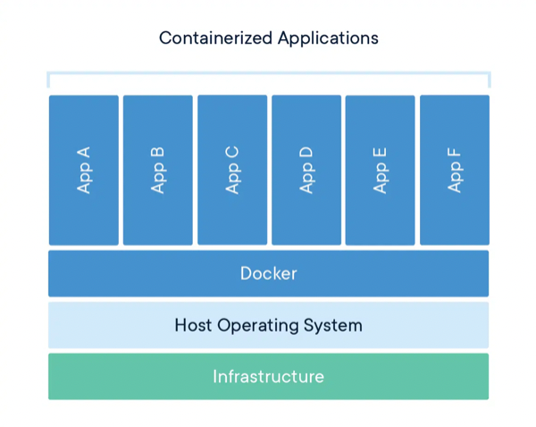{width="4.678124453193351in" height="3.7258584864391953in"}

Joonis 5.1.1. Konteinerdatud rakenduste toimimise lihtsustatud skeem \[57\]

Süsteemi arenduseks ja testimiseks loodi keskkond eraldiseisva arendusmasina peal, kasutades virtualiseerimiskeskkonda Dockerit \[58\]. Aluseks võeti Nvidia NGC keskkonnast PyTorchi konteiner, mõeldud x86_64 arhitektuuriga seadmetele \[59\]. Selle sisse ehitati Jetsoni tarkvaraliste spetsiifilisustega analoogne keskkond ning loodi ka koodis arhitektuuripõhised funktsioonid, mis rakendusid vastavalt eripäradele arendussüsteemile ja toodangsüsteemile (vt Joonis 5.1.2 ja 5.1.3).

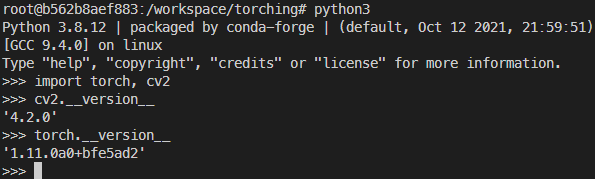{width="6.101744313210848in" height="1.8333333333333333in"}

Joonis 5.1.2. Arendusmasina konteinerisse installeeritud tarkvarade versioonid, mis ühilduvad toodangmasina konteineri seisundiga kõige paremini

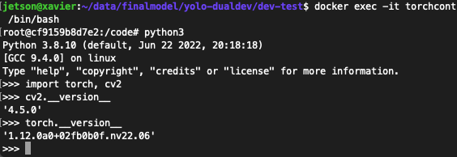{width="6.096262029746281in" height="2.0952613735783028in"}

Joonis 5.1.3. Toodangsüsteemi konteineri tarkvarade versioonid

Toodangsüsteemi jaoks loodi samuti konteiner, mille põhjaks konfigureeriti samuti NGC keskkonnast konteiner, mis on üles ehitatud L4T (*Linux for Tegra*) süsteemiga, spetsiifiliselt loodud aarch64 arhitektuuriga Jetson seadmetele \[60\]. See konfigureeriti vastavalt masinnägemiseks vajalike lisateekide ning seoti riistvaral oleva närvivõrkude mudelite optimeerimise rakendusega TensorRT \[61\].

## Põhiprogramm

Peamine töö toimub inferentsi skriptis (vt lihtsustatud Joonis 5.2.1, tehniline Joonis 5.2.3), millele kasutaja annab sisendiks närvivõrgumudeli ning selle vajalikud parameetrid, sisendstriimi (videofail või kaamera) ning vajadusel ka soovitud režiimi (videosalvestus või videoväljastuseta debugimiseks ja kiiruse kontrolliks mõeldud režiim) (vt Joonis 5.2.2)

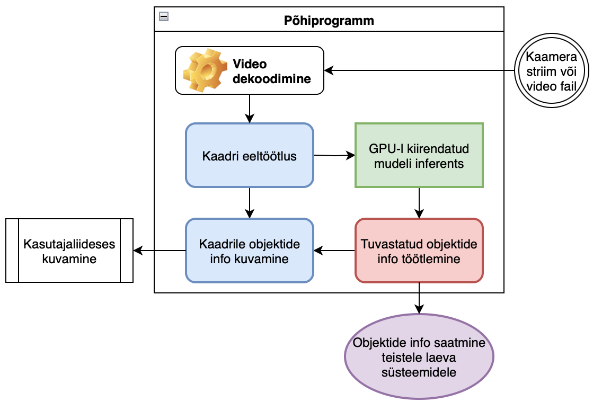{width="6.0089687226596675in" height="4.075758967629047in"}

Joonis 5.2.1. Põhiprogrammi lihtsustatud plokkskeem

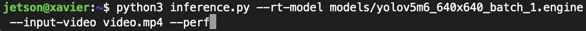{width="6.101744313210848in" height="0.3333333333333333in"}

Joonis 5.2.2. Põhiprogrammi käitamise näide käsurealt

Pythoniga käitatakse skript nimega inference.py, millele antakse sisendiks TensorRT-ga optimeeritud mudel, nimega yolov5m6, sisendstriimiks antakse videofail video.mp4, samuti lülitatakse sisse performance režiim, mis käitab protsessi ilma veebiliidese videoväljundita kasutajale, selle abil on võimalik hinnata süsteemi latentsust ning otsest mõju Xavieri ressursside kasutusele.

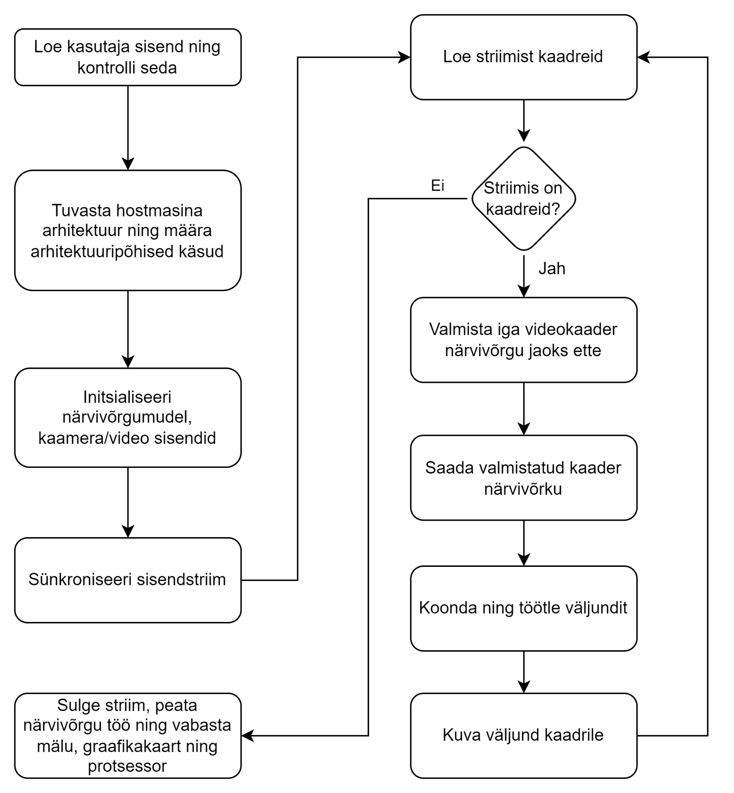{width="5.719791119860018in" height="6.175811461067367in"}

Joonis 5.2.3. Masinnägemise programmi toimimise lihtsustatud plokkskeem

Masina arhitektuuri tuvastamiseks kasutatakse pythoni moodulit, vastavalt millele rakendatakse vajalikud seadesätted skripti käitanud keskkonna jaoks. Arenduskeskkonnaks kasutatakse lauarvutit, mis on x86_64 arhitektuuriga, mille seadistamisel initsialiseeritakse vastav videodekooder ning enkooder, samuti määratakse ka erikasutusel olev port ning kaameratest tuleva info jaoks skaleerimise parameeter (vt Joonis 5.2.4).

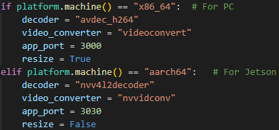{width="4.21875in" height="1.96875in"}

Joonis 5.2.4. Arhitektuuripõhiste parameetrite initsialiseerimine

Närvivõrgu mudel loetakse sisse kasutaja poolt defineeritud "model" parameetriga, mis kontrollib mudeli olemasolu ning faili formaati, antud juhul on mudeli formaadiks .engine tüüpi TensorRTga \[60\] optimeeritud mudelid. Pärast mudeli formaadi kontrolli loetakse sisse mudeli parameetrite metadata, vastavalt millele allokeeritakse graafikakaardi mälu ning tuumade ressurss.

Kaameratest info lugemiseks kasutatakse Nvidia graafikakaardil asetsevat riistvarakiirendit Nvidia Video Decoder (NVDEC) \[62\], mis võimaldab protsessoril ja graafikakaardil tegeleda täielikult närvivõrgu haldamise ning andmete töötlusega.

Kaameratest saadud kaadrid skaleeritakse närvivõrgule sobivasse sisendformaati, seejärel toimub mudelis kaadritelt informatsiooni hankimine ning statistiliste väljundite formuleerimine. Seejärel saadetakse väljundinfo järeltöötlusesse, kus toimub tulemuste vormistamine ning kaadrile tuvastatud objektide asukohtade ning kindluse tõenäosuse kuvamine (vt Joonis 5.2.5). Seejärel loetakse sisse uus kaader ning programmi töö kordub kuni enam kaadreid sisse ei tule ehk kas kaamera töö lõpeb või kasutaja lõpetab programmi töö.

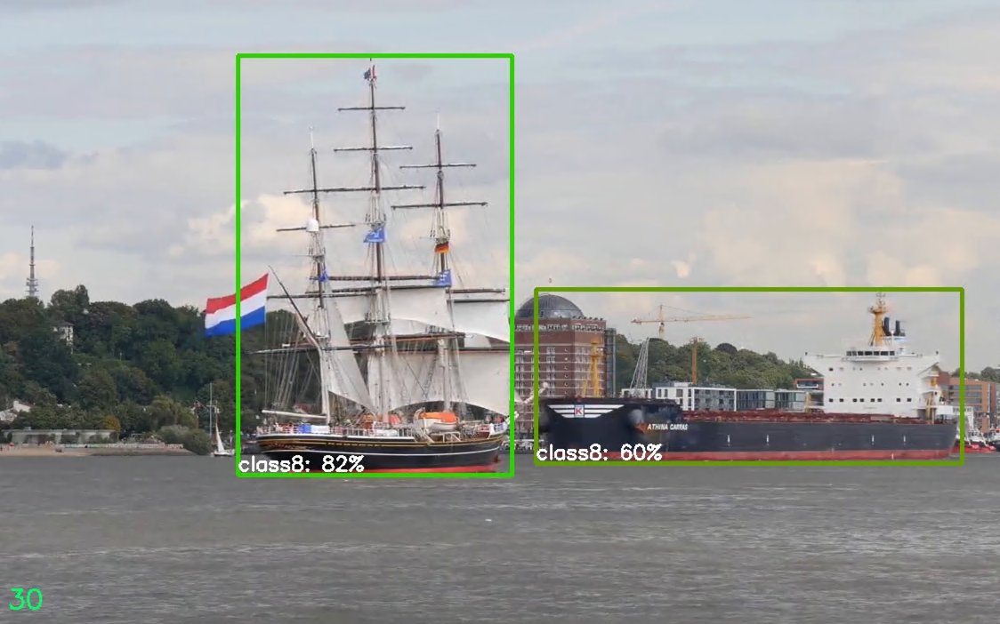{width="5.980207786526684in" height="3.724874234470691in"}

Joonis 5.2.5. Kaadrile kuvatud närvivõrgu poolt genereeritud ja töödeldud tuvastused (kastid ja nende sees olevad tuvastatud klassid koos tõenäosustega)

## Masinnägemise mudeli ja tarkvara optimeerimine

Masinnägemise rakenduse algfaasis esinesid mitmed probleemid nii kaameratelt sisendite lugemisel kui ka masinnägemise mudeli jooksutamisel riistvara peal.

Rakenduse esimeseks probleemiks oli kaameratelt tuleva striimi lugemine mitme sisendi korral, mis oli protsessorile koormav (kaadrite läbilaskevõime oli madal) ning seetõttu ka juhtkontrolleri temperatuur oli kõrge. Selle tagajärjena ei jätkunud ressurssi teistele seadmetele mis Jetsoniga suhtlesid (radari toimimine oli halvatud). Samuti ei olnud ka masinnägemine töövõimeline kuna kogu protsessor oli hõivatud kaameratelt tulevate kaadrite lugemise ning nende ümberskaleerimisega.

Selle lahendamiseks võeti kasutusele Jetsonisse integreeritud riistvaraline videodekooder NVDEC \[41\], OpenCV abil, millele anti ette kiirendusega gstreameri käsk, mis sisaldas endas sisendit ja videodekoodri kutsungit.

Teise probleemina ei olnud võimalik suuremaid masinnägemise mudeleid edukalt jooksutada, kuna mudelid laeti protsessori mällu ning marginaalne osa arvutuslikust tööst koos kaadrite töötlusega närvivõrgus kandus graafikakaardile (vt Joonis 5.3.1).

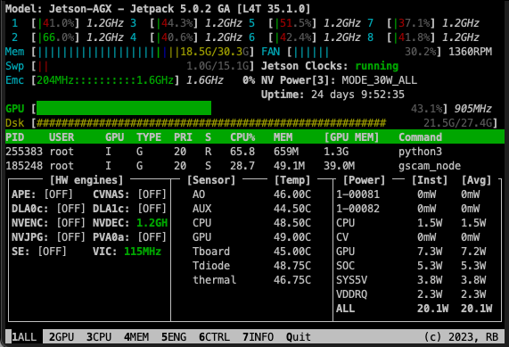{width="5.947916666666667in" height="4.052083333333333in"}Joonis 5.3.1. YOLOv5l, ühe sisendiga, resolutsioonil 640x640 pikslit, optimeerimata mudeli jooksmine ei utiliseeri kogu graafikakaarti, monitooringurakenduses jtop \[43\]

Antud probleemile leiti lahenduseks Nvidia TensorRT tööriist, mis on võimeline sisendiks võtma mitmes formaadis närvivõrke ning need vastavalt olemasolevale riistvarale kiirendama. Antud tööriista kasutamisel valmistati närvivõrgud ette ONNX \[63\] formaadis, mis on kõige universaalsem ning hõlpsasti kasutatav masinõppe mudelite interpreteerimise viis.

TensorRT tööpõhimõte on mudelis kvantiseerimine ehk mudeli parameetrite arvutusliku täpsuse vähendamine (nt 32lt ujukomaarvult, 16le ujukomaarvule), see võimaldab kasutada suure jõudlusega vektorarvutusi selleks spetsialiseeritud riistvaral marginaalsete mõjutustega mudeli täpsusele. Teisena toimub mudeli kärpimine ehk ebavajalike ning minimaalselt mudeli inferentsi tulemusi mõjutavate parameetrite eemaldamine, tehes mudeli mahtu väiksemaks, mille tõttu ka mudeli kiirus paraneb (vt peatükk 5.2).

Optimeerimiste tulemusena (vt Joonis 5.3.2) on:

- graafikakaardi kasutus tõusnud (43,1 % langes 99,8 %)

- keskmine energiakasutus vähenenud 26,8 % (20,1 W langes 14,7 W)

- töötemperatuurid langenud 3,3 % (46 ° langes 44,5 °)

- mälu kasutus langenud 1,6 % (18,5 GB langes 18,2 GB)

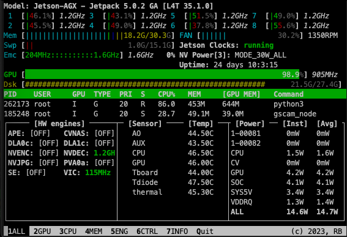{width="5.90625in" height="4.03125in"}Joonis 5.3.2. YOLOv5l, ühe sisendiga, resolutsioonil 640x640 pikslit, optimeeritud mudeli jooksmine utiliseerib kogu graafikakaardi

# TULEMUSED

Kõige sobivama mudeli valimisel lähtuti inferentsi kiirusest ja mudeli täpsusest objektide hindamisel. Kõik katsed on läbi viidud Jetson AGX Xavier 32 GB masina peal. Mudelite hindamise katsed on läbi viidud ideaaltingimustes, mis välistab kõikvõimalikud faktorid, mis võivad hinnatava mudeli testimise tulemustes hälbeid tekitada.

Antud katsetes analüüsitakse ainult närvivõrgu mudeli töötlemisvõimekust, eraldatuna ülejäänud süsteemist (kaamerad ning nendelt tulevate kaadrite eeltöötlus ning kaadritele tuvastatud objektide informatsiooni kuvamine ning edastamine teistele süsteemidele), et saada kõige optimaalsem ning hälbevaba tulemus mudelite jõudluse ning riistvara utiliseerituse kohta.

## Katsete läbiviimine

Katsete läbiviimise keskkond vastab järgnevatele tingimustele:

1.  Inferentsil kasutatavad kaadrid on spetsiifiliselt välja valitud, standardiseeritud ning enne testi algust ettevalmistatud ehk närvivõrgu sisendi suuruse jaoks skaleeritud ning eeltöödeldud. See välistab igasuguse lisatöö ja koormuse graafikakaardile ja protsessorile mis mõjutaks närvivõrgu tööd negatiivselt ning võimaldab kõiki katsetatavaid mudeleid hinnata samaväärselt ühise andmestiku peal.

2.  Katsetatavad mudelid on enne testjooksu läbiviimist riistvaraliselt eelsoojenduse faasi läbinud ehk on täielikult masina graafikakaardi mällu loetud ja läbinud 50 kalibreerimise inferentsi iteratsiooni, kasutades eelnevalt mainitud ette valmistatud testkaadreid, see võimaldab mudelite testfaasi jaoks luua keskkonna kus kõik mudelid on võrdselt ette valmistatud ning valmis töötama oma maksimaalsel võimekusel.

3.  Testjooksude arv on 1000, mille jooksul mõõdetakse ette valmistatud kaadritel tehtavat inferentsi kiirust ja tuvastustäpsust.

4.  Tuvastustäpsust hinnatakse järgmise valemiga:

> 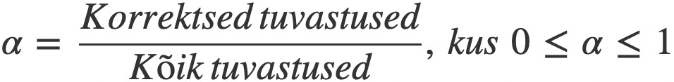{width="3.184417104111986in" height="0.3700207786526684in"}
>
> Mida lähemal tulem on ühele, seda täpsem on mudel ning suuteline tuvastama objekte.

5.  Mudeli kiirust hinnatakse inferentsiks kulunud ajaga millisekundites, (graafikutel kuvatuna töödeldud kaadrite hulk ühe sekundi jooksul)

Jetson AGX Xavieri tarkvaraline konfiguratsioon:

- JetPack 5.0.2

- Ubuntu 20.04.5

- kernel 5.10.104-tegra

- L4T 35.1.0

- Python 3.8.10

- torch 1.12.0

- torchvision 0.13.0

- cv2 4.5.0

- TensorRT 8.4.1.5

- CUDA 11.4

## Tulemuste analüüs

Katsed viidi läbi kahes konfiguratsioonis: ühe kaadriga ning kolme kaadriga paralleelselt protsessides, kuna toodangkeskkonnas rakendatakse kolmest kaadrist tuleva info peal närvivõrgu töötlust. Joonistel kujutatud *mean Average Precision* parameeter (kollases) väljendab mudeli keskmist summaarset täpsust kõikide klasside peale kokku, see tuleneb katsetest, mis viidi läbi COCO 2017 aasta valideerimise andmestikust valitud klassidel, kus kõikidest klassidest valiti võrdne hulk testandmeid \[64\], *accuracy* parameeter (punases) saavutati eraldi loodud andmestikul, mis sisaldas ainult laevu. Katsete tulemused on kujutatud mudelite suuruste ehk parameetrite hulga järgi kasvavas järjekorras, väikseim mudel vasakul, suurim paremal, et tagada intuitiivne ülevaade kõikidest parameetritest.

Suuremate sisenditega mudelite joonistel (vt Joonis 6.2.2 ja 6.2.4) tekkinud täpsuse kõikumised on põhjustatud sellest et "6" lõpuga mudelite skaleerimisekihid on loodud suuremate sisendresolutsioonide jaoks ning teiste mudelite kihid, väiksemate sisendresolutsioonide jaoks \[65\]. Seetõttu on ka viimaste täpsus väiksem antud resolutsioonil.

Optimeeritud mudelite ja optimeerimata mudelite kiiruste vahe on vähemalt kahekordne, kõige suurem kiiruste vahe on 4,28 kordne, mudelitepaaril yolov5l6 (vt Joonis 6.2.3). Optimeeritud ning optimeerimata mudelite täpsuste vahe minimaalne (${1,7 \cdot 10}^{- 3}$), ehk optimeerimine täpsust oluliselt ei mõjutanud. Seetõttu graafikul algselt kuvatud täpsuste väärtused olid ülekattega, mistõttu kuvatakse nende keskmistatud väärtusi.

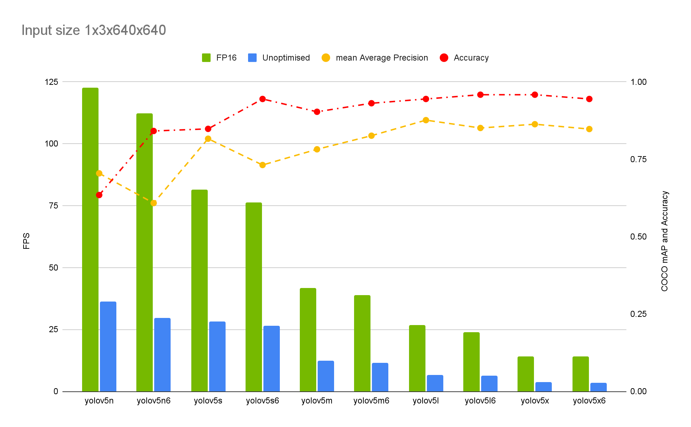{width="6.101744313210848in" height="3.7777777777777777in"}Joonis 6.2.1. Mudelite jõudlus 1 kaadri sisendiga, suurusel 640x640 pikslit

Kiireima ja aeglaseima optimeeritud mudeli kiiruste vahe on 108 kaadrit sekundis, kusjuures parim kiirendus neljakordne. Keskmine optimeeritud kiiruste vahe 3,5 kordne. Mudelite täpsus kasvab YOLOv5l mudelini ning sealt edasi olulist täpsuse kasvu ei ole, seega sellest mudelist alates kiiruse ja täpsuse suhe väheneb.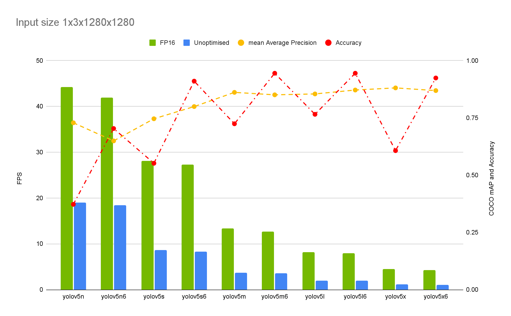{width="6.101744313210848in" height="3.7777777777777777in"}Joonis 6.2.2. Mudelite jõudlus 1 kaadri sisendiga, suurusel 1280x1280 pikslit

Kiireima ja aeglaseima optimeeritud mudeli kiiruste vahe on 40 kaadrit sekundis, parim kiirendus 4,1 kordne. Keskmine optimeeritud kiiruste vahe 3,5 kordne. Mudelite täpsus kasvab YOLOv5m mudelini ning sealt edasi olulist täpsuse kasvu ei ole, seega sellest mudelist alates kiiruse ja täpsuse suhe väheneb.

Ühe sisendiga 640x640 ja 1280x1280 resolutsiooniga mudelite kiiruste keskmine vahe on 36 kaadrit sekundis.

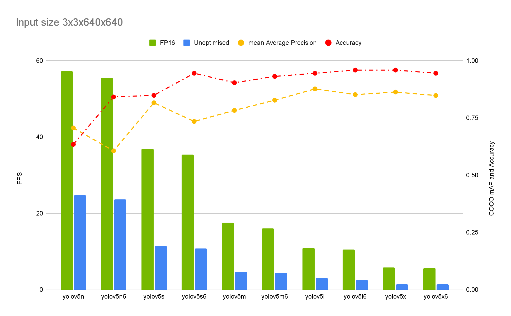{width="6.101744313210848in" height="3.7777777777777777in"}Joonis 6.2.3. Mudelite jõudlus 3 kaadri sisendiga paralleelselt, suurusel 640x640 pikslit

Kiireima ja aeglaseima optimeeritud mudeli kiiruste vahe on 52 kaadrit sekundis, parim kiirendus 4,3 kordne. Keskmine optimeeritud kiiruste vahe 3,4 kordne. Mudelite täpsus kasvab YOLOv5l mudelini ning sealt edasi olulist täpsuse kasvu ei ole, seega sellest mudelist alates kiiruse ja täpsuse suhe väheneb.

Kolme sisendiga resolutsiooniga 640x640 mudelid on keskmiselt 1,4 korda kiiremad kui ühe sisendiga sama resolutsiooniga mudelid.

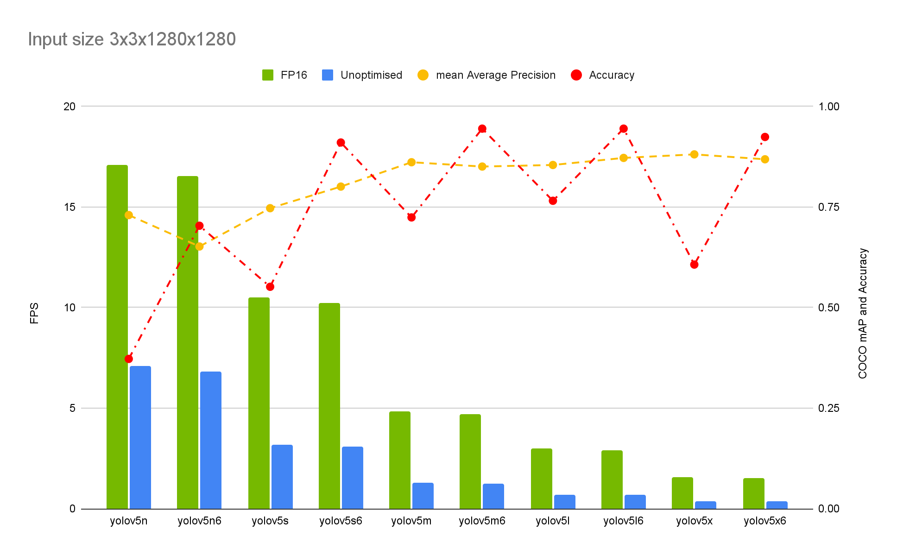{width="6.101744313210848in" height="3.7777777777777777in"}

Joonis 6.2.4. Mudelite jõudlus 3 kaadri sisendiga paralleelselt, suurusel 1280x1280 pikslit

Kiireima ja aeglaseima optimeeritud mudeli kiiruste vahe 16 kaadrit sekundis, parim kiirendus 4,2 kordne. Keskmine optimeeritud mudelite kiiruste vahe 3,5 kordne. Mudelite täpsus kasvab YOLOv5m mudelini ning sealt edasi olulist täpsuse kasvu ei ole, seega sellest mudelist alates kiiruse ja täpsuse suhe väheneb. Antud juhul on tegemist 1,1 korda kiiremate mudelitega, võrreldes ühe sisendiga mudeleid, samal resolutsioonil.

Kolme sisendiga 640x640 ja 1280x1280 resolutsiooniga mudelite kiiruste keskmine vahe on 18 kaadrit sekundis.

Kolme sisendiga mudelid on keskmiselt 1,2 korda kiiremad kui ühe sisendiga mudelid.

# KOKKUVÕTE

Masinnägemise süsteemi arenduseks leiti sobivad komponendid, mis lõpptulemusena toimisid omavahel heas koostöös, tagades süsteemi eduka ning nõuetekohase toimimise riistvara ja tarkvara näol.

Riistvaraliselt valitud juhtkontrolleriks Nvidia Jetson AGX Xavier, mis suudab edukalt mitme sisendiga, suuremaid ning täpseid närvivõrgu mudeleid jooksutada. Samuti võimaldas ka antud kontrolleri riistvara suure kasuteguriga mudelite kiirendamist, mis aitas oluliselt masinnägemise rakenduse tööl kaameralt saadud kaadrite töötlemise kiirusele kaasa. Samuti aitas ka täpsematele objektide tuvastamisele kaasa kaamerateks valitud Arducam Fisheye moodul võimaldas edastada juhtkontrollerile nõuetekohase resolutsiooniga informatsiooni.

Tarkvaraliselt oli olulisel kohal kogu rakenduse konteinerdamine, mis võimaldas rakenduse arendamist ning toodangkeskkonnas käitamist hõlpsamaks teha, kuna sellisel meetodil oli rakendust võimalik käitada erinevatel arvutisüsteemidel ilma muudatusteta süsteemi enda tarkvaras.

Masinnägemise tarkvara olulisim komponent oli objektide tuvastuseks valitud meetod ehk masinnägemise jaoks loodud närvivõrgumudelid. Nende seast valiti YOLOv5 Ultralyticsi poolt, mis oli parim võrreldes teiste saadavalolevate mudelitega oma ühendatud objektide tuvastuse ning nende sildistamise arhitektuuri ja parima kiiruse ning täpsuse suhte poolest. Samuti oli see üks vähestest saadavalolevatest mudelitest, mida oli võimalik edukalt riistvaraliselt kiirendada.

Kõige olulisemad tulemused masinnägemise mudelite katsetes

- Masinnägemise mudelite täpsus kasvab YOLOv5m / YOLOv5l mudelini

- Keskmine täpsuse muutus optimeeritud ja optimeerimata mudelite võrdluses oli väike ${1,7 \cdot 10}^{- 3}$

- Keskmine mudelite kiiruse kasv pärast optimeerimist oli 3,5 kordne

- Parima optimeeritud mudeli kiiruse kasv võrreldes optimeerimata versiooniga oli 4,3 kordne

Masinnägemise rakenduse optimeerimisel saavutati sujuv ja kiirendatud rakenduse töö, kusjuures optimeerimise tulemusena vähenes juhtkontrolleri energiakasutus olulisel määral (26,8 %) ning seetõttu olid ka töötemperatuurid madalamad. Samuti toimus selle tõttu ka andmete töötlus ja närvivõrgu töö oluliselt kiiremini ning kogu juhtkontrolleri riistvaralised kiirendid olid otstarbekalt kasutuses.

# KASUTATUD KIRJANDUSE LOETELU

\[1\] Blockage of the Suez Canal, March 2021 \[WWW\]

> <https://porteconomicsmanagement.org/pemp/contents/part6/port->resilience/suez-canal-blockage-2021/

(20. okt. 2021)

\[2\] Drowning, WHO \[WWW\]

> https://www.who.int/news-room/fact-sheets/detail/drowning
>
> (28. okt. 2021)

\[3\] Marine Insight, 7 Dangerous Diseases/Disorders Seafarers Should Be Aware Of \[WWW\]

> https://www.marineinsight.com/marine-safety/7-dangerous-diseasesdisorders-seafarers-should-be-aware-of/
>
> (28. okt. 2021)

\[4\] Tesla, Future of Driving \[WWW\]

> https://www.tesla.com/autopilot
>
> (10. jaanuar 2023)

\[5\] Lucid Announces Integration of Its Proprietary DreamDrive Pro Advanced Driver-Assistance System with NVIDIA DRIVE Hyperion Software-Defined Platform \[WWW\]

> https://ir.lucidmotors.com/news-releases/news-release-details/lucid-announces-integration-its-proprietary-dreamdrive-pro
>
> (10. jaanuar 2023)

\[6\] Waymo, The World's Most Experienced Driver \[WWW\]

> https://waymo.com
>
> (10. jaanuar 2023)

\[7\] Nvidia Drive, End-to-End Solutions for Autonomous Vehicles \[WWW\]

> https://developer.nvidia.com/drive
>
> (10. jaanuar 2023)

\[8\] Comma.ai, Openpilot: An open source driver assistance system \[WWW\]

https://github.com/commaai/openpilot

(10. jaanuar 2023)

\[9\] Kongsberg, Autonomous Shipping \[WWW\]

https://www.kongsberg.com/maritime/support/themes/autonomous-shipping/

(20. okt. 2021)

\[10\] Rolls Royce, Autonomous Ships \[WWW\]

> https://www.rolls-royce.com/\~/media/Files/R/Rolls-Royce/documents/%20customers/marine/ship-intel/rr-ship-intel-aawa-8pg.pdf
>
> (20. okt. 2021)

\[11\] Täisskaalas laevade autonoomsed käigukatsed avavees \[WWW\]

> https://www.scc.ee/taisskaalas-laevade-autonoomsed-kaigukatsed-avavees/
>
> (14. veeb 2022)

\[12\] Navy 18 WP -- Baltic WorkBoats \[WWW\]

> https://bwb.ee/vessel/navy-18-wp/
>
> (27. märts 2022)

\[13\] Laevade eelseadistatud autonoomsete avaveekatsete tehnoloogia arendamine \[WWW\]

> https://www.etis.ee/Portal/Projects/Display/fde46bb2-4579-42ad-bbe9-5bc7c1bef77d
>
> (31. märts 2022)

\[14\] What is computer vision? \[WWW\]

> https://www.ibm.com/topics/computer-vision#:\~:text=Computer%20vision%20is%20a%20field,recommendations%20based%20on%20that%20information.
>
> (04. aprill 2022)

\[15\] A Comprehensive Guide to Convolutional Neural Networks \[WWW\]

> https://towardsdatascience.com/a-comprehensive-guide-to-convolutional-neural-networks-the-eli5-way-3bd2b1164a53
>
> (02. mai 2022)

\[16\] Rectified Linear Unit, DeepAI \[WWW\]

> https://deepai.org/machine-learning-glossary-and-terms/relu
>
> (13. mai 2022)

\[17\] Multi-Class Neural Networks: Softmax \[WWW\]

> https://developers.google.com/machine-learning/crash-course/multi-class-neural-networks/softmax
>
> (14. mai 2022)

\[18\] Convolutional Neural Networks \[WWW\]

> https://www.ibm.com/cloud/learn/convolutional-neural-networks
>
> (15. mai 2022)

\[19\] Technopedia, Single-Board Computer \[WWW\]

> https://www.techopedia.com/definition/9266/single-board-computer-sbc
>
> (06. dets. 2021)

\[20\] Nvidia Embedded AI Systems \[WWW\]

> https://www.nvidia.com/en-us/autonomous-machines/embedded-systems/
>
> (06. dets. 2021)

\[21\] Raspberry Pi, Model 4B datasheet \[WWW\]

> https://datasheets.raspberrypi.com/rpi4/raspberry-pi-4-datasheet.pdf
>
> (06. dets. 2021)

\[22\] Graphics Processing Unit \[WWW\]

> https://graphics.fandom.com/wiki/Graphics_processing_unit
>
> (06. dets. 2021)

\[23\] CUDA FAQ \[WWW\]

> https://developer.nvidia.com/cuda-faq
>
> (11. veeb 2022)

\[24\] Jetson Modules Technical Specifications \[WWW\]

> https://developer.nvidia.com/embedded/jetson-modules
>
> (22. jaan. 2022)

\[25\] Nvidia Volta Architecture \[WWW\]

> https://www.olcf.ornl.gov/wp-content/uploads/2018/12/summit_workshop_Volta-Architecture.pdf
>
> (12. märts 2022)

\[26\] Jetson AGX Xavier \[WWW\]

> https://developer.nvidia.com/blog/nvidia-jetson-agx-xavier-32-teraops-ai-robotics/
>
> (09. veeb 2022)

\[27\] NVIDIA Jetson AGX Xavier Delivers 32 TeraOps for New Era of AI in Robotics \[WWW\]

> https://developer.nvidia.com/blog/nvidia-jetson-agx-xavier-32-teraops-ai-robotics/
>
> (10. veeb 2022)

\[28\] SurveilsQUAD - Sony IMX290 Synchronized Multi-Camera System \[WWW\]

> https://www.e-consystems.com/nvidia-cameras/jetson-agx-xavier-cameras/sony-starvis-imx290-synchronized-multi-camera.asp#key-features
>
> (07. veeb 2022)

\[29\] OpenCV AI Kit: OAK---D-PoE-- OpenCV.AI \[WWW\]

> https://store.opencv.ai/products/oak-d-poe
>
> (07. veeb 2022)

\[30\] OAK-1-PoE --- DepthAI Hardware Documentation 1.0.0 documentation \[WWW\]

> https://docs.luxonis.com/projects/hardware/en/latest/pages/SJ2096POE.html
>
> (07. veeb 2022)

\[31\] Atlas IP67 7.1 MP Model \[WWW\]

> https://thinklucid.com/product/atlas-ip67-7-1-mp-imx420/
>
> (06. veeb 2022)

\[32\] Atlas IP67 2.8 MP Model \[WWW\]

> https://thinklucid.com/product/atlas-ip67-2-8-mp-imx421/
>
> (06. veeb 2022)

\[33\] Arducam 12MP IMX477 \[WWW\]

> https://www.uctronics.com/arducam-12mp-imx477-camera-and-2-1mp-ov9282-monochrome-camera-with-dm1090ffc.html
>
> (08. veeb 2022)

\[34\] Arducam Fisheye Camera for Raspberry Pi -- 5MP OV5647 \[WWW\]

> https://www.arducam.com/product/arducam-raspberry-pi-camera-5mp-fisheye-m12-picam-b0055/
>
> (29. märts 2022)

\[35\] Mindchip Artificial Captain \[WWW\]

> https://mindchip.ee/artificial-captain/
>
> (10. jaanuar 2023)

\[36\] OpenCV \[WWW\]

> https://opencv.org/
>
> (22. aprill 2022)

\[37\] Scikit-Image, Image processing in Python \[WWW\]

> https://scikit-image.org/
>
> (22. aprill 2022)

\[38\] SciPy - Fundamental algorithms for scientific computing in Python \[WWW\]

> https://scipy.org/
>
> (22. aprill 2022)

\[39\] Pillow -- Python Imaging Library (Fork) \[WWW\]

> https://pillow.readthedocs.io/en/stable/
>
> (22. aprill 2022)

\[40\] GStreamer, Open source multimedia framework \[WWW\]

> https://gstreamer.freedesktop.org/
>
> (26. aprill 2022)

\[41\] Nvidia Video Decoder \[WWW\]

> https://developer.nvidia.com/nvidia-video-codec-sdk
>
> (26. aprill 2022)

\[42\] Pandas - Python Data Analysis Library \[WWW\]

> https://pandas.pydata.org/
>
> (29. aprill 2022)

\[43\] Jetson-Stats \[WWW\]

> https://github.com/rbonghi/jetson_stats
>
> (10. jaanuar 2023)

\[44\] cuDF, A Python GPU DataFrame library \[WWW\]

> https://docs.rapids.ai/api/cudf/stable/
>
> (29. aprill 2022)

\[45\] Create production-grade machine learning models with TensorFlow \[WWW\]

> https://www.tensorflow.org
>
> (10. jaanuar 2023)

\[46\] Keras, Deep Learning for humans \[WWW\]

> https://keras.io
>
> (10. jaanuar 2023)

\[47\] PyTorch, Tensors and Dynamic neural networks in Python with strong GPU acceleration \[WWW\]

> https://pytorch.org
>
> (10. jaanuar 2023)

\[48\] scikit-learn, Machine Learning in Python \[WWW\]

https://scikit-learn.org/stable/

(10. jaanuar 2023)

\[49\] Faster R-CNN: Towards Real-Time Object Detection with Region Proposal Networks \[WWW\]

https://arxiv.org/pdf/1506.01497.pdf

(10. jaanuar 2023)

\[50\] Ultralytics, YOLOv5 \[WWW\]

> https://github.com/ultralytics/yolov5
>
> (10. jaanuar 2023)

\[51\] MobileNetV2: Inverted Residuals and Linear Bottlenecks \[WWW\]

> https://arxiv.org/pdf/1801.04381.pdf
>
> (10. jaanuar 2023)

\[52\] EfficientDet: Scalable and Efficient Object Detection \[WWW\]

> https://arxiv.org/pdf/1911.09070.pdf
>
> (10. jaanuar 2023)

\[53\] YOLOv5: The friendliest AI architecture you\'ll ever use \[WWW\]

> https://ultralytics.com/yolov5
>
> (10. jaanuar 2023)

\[54\] YOLOv4 / Scaled-YOLOv4 / YOLO - Neural Networks for Object Detection \[WWW\]

> https://github.com/AlexeyAB/darknet
>
> (10. jaanuar 2023)

\[55\] A Forest Fire Detection System Based on Ensemble Learning \[WWW\]

> https://www.mdpi.com/1999-4907/12/2/217
>
> (10. jaanuar 2023)

\[56\] Yolo-dualdev, Develop and deploy TensorRT optimized YOLO models on Nvidia

Jetson and PC environments

https://github.com/The-Magicians-Code/yolo-dualdev

(17. mai 2023)

\[57\] Docker, Use containers to Build, Share and Run your applications \[WWW\]

> https://www.docker.com/resources/what-container/
>
> (10. jaanuar 2023)

\[58\] Docker: Accelerated, Containerized Application Development \[WWW\]

> https://www.docker.com
>
> (10. jaanuar 2023)

\[59\] The PyTorch NGC Container \[WWW\]

> https://catalog.ngc.nvidia.com/orgs/nvidia/containers/pytorch
>
> (10. jaanuar 2023)

\[60\] Machine Learning Container for Jetson and JetPack \[WWW\]

> https://catalog.ngc.nvidia.com/orgs/nvidia/containers/l4t-ml
>
> (10. jaanuar 2023)

\[61\] Nvidia TensorRT \[WWW\]

https://developer.nvidia.com/tensorrt

(10. jaanuar 2023)

\[62\] Accelerated GStreamer User Guide \[WWW\]

> https://developer.download.nvidia.com/embedded/L4T/r32_Release_v1.0/Docs/Accelerated_GStreamer_User_Guide.pdf?t=eyJscyI6ImdzZW8iLCJsc2QiOiJodHRwczovL3d3dy5nb29nbGUuY29tLyJ9

(10. jaanuar 2023)

\[63\] Open Neural Network Exchange \[WWW\]

> https://onnx.ai
>
> (10. jaanuar 2023)

\[64\] COCO, Common Objects in Context \[WWW\]

> https://cocodataset.org
>
> (10. jaanuar 2023)

\[65\] YOLOv5, Pretrained checkpoints \[WWW\]

> https://github.com/ultralytics/yolov5#pretrained-checkpoints
>
> (10. jaanuar 2023

[^1]: *Lihtlitsents ei kehti juurdepääsupiirangu kehtivuse ajal vastavalt üliõpilase taotlusele lõputööle juurdepääsupiirangu kehtestamiseks, mis on allkirjastatud teaduskonna dekaani poolt, välja arvatud ülikooli õigus lõputööd reprodutseerida üksnes säilitamise eesmärgil. Kui lõputöö on loonud kaks või enam isikut oma ühise loomingulise tegevusega ning lõputöö kaas- või ühisautor(id) ei ole andnud lõputööd kaitsvale üliõpilasele kindlaksmääratud tähtajaks nõusolekut lõputöö reprodutseerimiseks ja avalikustamiseks vastavalt lihtlitsentsi punktidele 1.1. ja 1.2, siis lihtlitsents nimetatud tähtaja jooksul ei kehti.*
